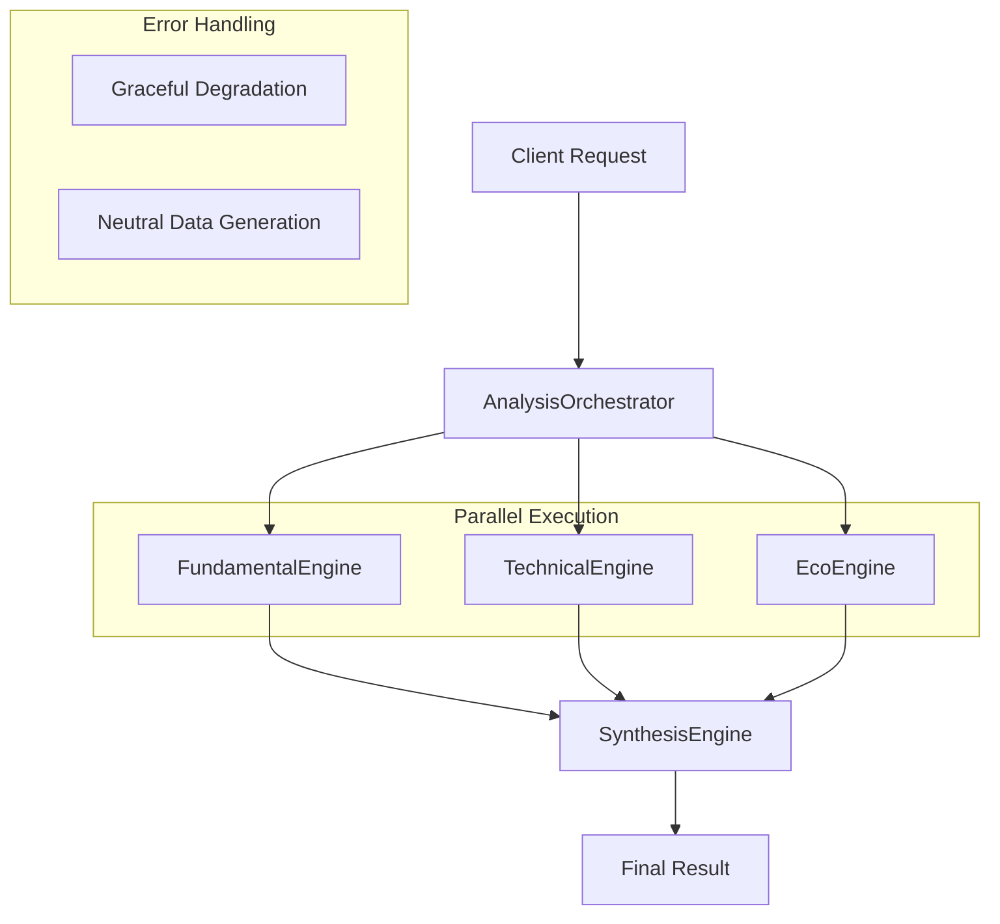

# Design Document

## Overview

The analysis-engine refactoring project transforms our monolithic signal-360-analysis function into a modular, high-performance analysis system. The new architecture separates concerns into specialized engines while maintaining performance through parallel execution and providing resilience through graceful error handling.

The design follows a conductor pattern where the AnalysisOrchestrator coordinates multiple specialized engines, each responsible for a specific type of analysis. This approach improves maintainability, testability, and allows for independent development of each analysis type.

## Architecture

### High-Level Architecture



### Directory Structure

```
supabase/functions/analysis-engine/
├── index.ts                 # AnalysisOrchestrator (main entry point)
├── types.ts                 # Shared interfaces and types
├── fundamental-engine.ts    # Fundamental analysis engine
├── technical-engine.ts      # Technical analysis engine (placeholder)
├── eco-engine.ts           # Sentiment/news analysis engine (placeholder)
└── synthesis-engine.ts     # Final verdict generation engine
```

### Data Flow

1. **Request Reception**: AnalysisOrchestrator receives POST request with ticker, context, and apiKey
2. **Parallel Execution**: Orchestrator launches FundamentalEngine, TechnicalEngine, and EcoEngine simultaneously
3. **Result Aggregation**: Orchestrator collects results using Promise.allSettled for resilience
4. **Synthesis**: SynthesisEngine processes aggregated results and generates final verdict
5. **Response**: Structured SynthesisResult returned to client

## Components and Interfaces

### Core Types (types.ts)

```typescript
// Base analysis result interface for individual engines
export interface AnalysisResult {
  score: number;                    // 0-100 analysis score
  confidence: number;               // 0-1 confidence level
  factors: AnalysisFactor[];        // Supporting factors
  metadata: AnalysisMetadata;       // Engine-specific metadata
  timestamp: string;                // Analysis timestamp
  status: 'success' | 'error' | 'partial';
}

// Analysis factor interface
export interface AnalysisFactor {
  type: 'positive' | 'negative';
  category: string;
  description: string;
  weight: number;                   // Impact weight 0-1
  confidence?: number;              // Factor confidence 0-1
}

// Engine metadata interface
export interface AnalysisMetadata {
  engineVersion: string;
  dataSource: string;
  processingTime: number;
  dataQuality: number;              // 0-1 data quality score
  [key: string]: any;               // Engine-specific fields
}

// Final synthesis result interface
export interface SynthesisResult {
  synthesis_score: number;          // 0-100 final score
  convergence_factors: ConvergenceFactor[];
  divergence_factors: DivergenceFactor[];
  trade_parameters: TradeParameters;
  full_report: AnalysisReport;
  confidence: number;               // Overall confidence 0-1
}

// Request interface
export interface AnalysisRequest {
  ticker: string;
  context: 'investment' | 'trading';
  apiKey: string;
}

// Migrated interfaces from googleApiService.ts
export interface CompanyInfo {
  name: string;
  sector: string;
  industry: string;
  marketCap: number;
  sharesOutstanding: number;
  currentPrice: number;
  peRatio: number;
  pbRatio: number;
  dividendYield: number;
  beta: number;
  description?: string;
  website?: string;
  employees?: number;
}

export interface FinancialStatement {
  revenue: number;
  netIncome: number;
  totalAssets: number;
  totalLiabilities: number;
  shareholderEquity: number;
  operatingCashFlow: number;
  freeCashFlow: number;
  totalDebt: number;
  currentAssets: number;
  currentLiabilities: number;
  period: string;
  reportDate: string;
}

export interface FinancialRatios {
  profitability: {
    roe: number;
    roa: number;
    netMargin: number;
    grossMargin: number;
    operatingMargin: number;
  };
  liquidity: {
    currentRatio: number;
    quickRatio: number;
    cashRatio: number;
  };
  leverage: {
    debtToEquity: number;
    debtRatio: number;
    equityRatio: number;
    timesInterestEarned: number;
  };
  efficiency: {
    assetTurnover: number;
    inventoryTurnover: number;
    receivablesTurnover: number;
  };
  valuation: {
    peRatio: number;
    pbRatio: number;
    psRatio: number;
    pegRatio: number;
    evToEbitda: number;
  };
}

export interface FundamentalAnalysisData {
  ticker: string;
  companyInfo: CompanyInfo;
  financialStatements: FinancialStatement[];
  financialRatios: FinancialRatios;
  growthMetrics: {
    revenueGrowth: number;
    earningsGrowth: number;
    fcfGrowth: number;
    revenueCAGR3Y: number;
    earningsCAGR3Y: number;
  };
  qualityIndicators: {
    roicTrend: number;
    marginStability: number;
    debtTrend: number;
    fcfConsistency: number;
  };
  dataSources: string[];
  lastUpdated: string;
}
```

### AnalysisOrchestrator (index.ts)

The main entry point and coordinator of the analysis process.

**Responsibilities:**
- Handle HTTP requests and validate input
- Initialize and coordinate all analysis engines
- Execute engines in parallel using Promise.allSettled
- Handle engine failures gracefully
- Coordinate with SynthesisEngine for final result
- Return structured response

**Key Methods:**
- `handleRequest(request: Request): Promise<Response>`
- `orchestrateAnalysis(ticker: string, context: string, apiKey: string): Promise<SynthesisResult>`
- `executeEnginesInParallel(ticker: string, apiKey: string): Promise<EngineResults>`
- `handleEngineFailures(results: PromiseSettledResult[]): EngineResults`

### FundamentalEngine (fundamental-engine.ts)

Handles fundamental analysis with real data fetching capabilities.

**Responsibilities:**
- Migrate and refactor EnhancedGoogleApiClient logic
- Fetch real financial data from external APIs
- Calculate financial ratios and metrics
- Generate fundamental analysis factors
- Return structured AnalysisResult

**Key Methods:**
- `analyze(ticker: string, apiKey: string): Promise<AnalysisResult>`
- `fetchFundamentalData(ticker: string, apiKey: string): Promise<FundamentalAnalysisData>`
- `calculateScore(data: FundamentalAnalysisData): number`
- `generateFactors(data: FundamentalAnalysisData): AnalysisFactor[]`

**Data Sources:**
- Google Custom Search API
- Alpha Vantage API (free tier)
- Financial Modeling Prep API (fallback)
- Mock data generation (final fallback)

### TechnicalEngine (technical-engine.ts)

Handles technical chart analysis (initial placeholder implementation).

**Responsibilities:**
- Return structured AnalysisResult with realistic mock data
- Simulate technical analysis patterns
- Generate technical factors (support/resistance, momentum, etc.)
- Maintain consistent response format for future real implementation

**Key Methods:**
- `analyze(ticker: string): Promise<AnalysisResult>`
- `generateMockTechnicalData(ticker: string): TechnicalData`
- `calculateMockScore(ticker: string): number`
- `generateMockFactors(ticker: string): AnalysisFactor[]`

### EcoEngine (eco-engine.ts)

Handles sentiment and news analysis (initial placeholder implementation).

**Responsibilities:**
- Return structured AnalysisResult with realistic mock data
- Simulate sentiment analysis patterns
- Generate ESG and news-based factors
- Maintain consistent response format for future real implementation

**Key Methods:**
- `analyze(ticker: string): Promise<AnalysisResult>`
- `generateMockSentimentData(ticker: string): SentimentData`
- `calculateMockScore(ticker: string): number`
- `generateMockFactors(ticker: string): AnalysisFactor[]`

### SynthesisEngine (synthesis-engine.ts)

Generates final verdict by weighing and combining analysis results.

**Responsibilities:**
- Receive results from all analysis engines
- Apply context-based weighting (investment vs trading)
- Generate convergence and divergence factors
- Calculate final synthesis score
- Generate comprehensive analysis report
- Calculate trade parameters

**Key Methods:**
- `synthesize(results: EngineResults, context: string): Promise<SynthesisResult>`
- `calculateWeightedScore(results: EngineResults, context: string): number`
- `generateConvergenceFactors(results: EngineResults): ConvergenceFactor[]`
- `generateDivergenceFactors(results: EngineResults): DivergenceFactor[]`
- `calculateTradeParameters(score: number, context: string): TradeParameters`

**Weighting Logic:**
- Investment context: Fundamental (60%), Technical (25%), ESG (15%)
- Trading context: Technical (50%), Fundamental (35%), ESG (15%)

## Data Models

### Engine Results Structure

```typescript
interface EngineResults {
  fundamental: AnalysisResult | null;
  technical: AnalysisResult | null;
  eco: AnalysisResult | null;
  errors: EngineError[];
}

interface EngineError {
  engine: string;
  error: Error;
  timestamp: string;
}
```

### Neutral Data Generation

When engines fail, the system generates neutral data to allow synthesis to proceed:

```typescript
const neutralResult: AnalysisResult = {
  score: 50,                    // Neutral score
  confidence: 0.1,              // Low confidence
  factors: [],                  // No factors
  metadata: {
    engineVersion: 'neutral',
    dataSource: 'fallback',
    processingTime: 0,
    dataQuality: 0
  },
  timestamp: new Date().toISOString(),
  status: 'error'
};
```

## Error Handling

### Graceful Degradation Strategy

1. **Individual Engine Failures**: Continue with successful engines, use neutral data for failed ones
2. **Partial Data**: Accept partial results and adjust confidence accordingly
3. **Complete Failure**: Return error response with appropriate HTTP status code
4. **API Rate Limits**: Implement exponential backoff and fallback to mock data

### Error Types

- **ValidationError**: Invalid input parameters
- **AuthenticationError**: Invalid or expired API key
- **RateLimitError**: API rate limit exceeded
- **NetworkError**: Network connectivity issues
- **ProcessingError**: Internal processing failures

### Logging Strategy

- Log all engine executions with performance metrics
- Log errors with context for debugging
- Log API usage for monitoring rate limits
- Use structured logging for better observability

## Testing Strategy

### Unit Testing

- Test each engine independently with mock data
- Test error handling scenarios
- Test weighting and synthesis logic
- Test type validation and edge cases

### Integration Testing

- Test orchestrator with real engine implementations
- Test parallel execution and error handling
- Test API integration with real external services
- Test end-to-end request/response flow

### Performance Testing

- Measure parallel execution performance
- Test with various ticker symbols and contexts
- Monitor memory usage and response times
- Test under simulated load conditions

### Mock Data Strategy

- Use deterministic mock data for consistent testing
- Simulate various market conditions and scenarios
- Test edge cases with extreme values
- Validate mock data structure matches real data

## Security Considerations

### API Key Management

- Validate API key format before processing
- Never log API keys in plain text
- Use secure transmission for API calls
- Implement rate limiting per API key

### Input Validation

- Validate ticker symbol format
- Sanitize all input parameters
- Prevent injection attacks
- Validate context parameter values

### External API Security

- Use HTTPS for all external API calls
- Implement timeout and retry mechanisms
- Validate external API responses
- Handle malicious or malformed responses

## Performance Optimization

### Parallel Execution

- Use Promise.allSettled for concurrent engine execution
- Implement timeout mechanisms for each engine
- Monitor and optimize engine execution times
- Balance load across external APIs

### Caching Strategy

- Cache fundamental data for short periods (5-15 minutes)
- Cache company information for longer periods (1 hour)
- Implement cache invalidation strategies
- Use memory-efficient caching mechanisms

### Resource Management

- Implement connection pooling for external APIs
- Monitor memory usage and garbage collection
- Optimize data structures for performance
- Implement request queuing for rate limit management

## Migration Strategy

### Phase 1: Core Infrastructure

1. Create analysis-engine directory structure
2. Implement types.ts with all interfaces
3. Create AnalysisOrchestrator with basic routing
4. Implement error handling and logging

### Phase 2: Engine Implementation

1. Migrate FundamentalEngine from googleApiService
2. Implement placeholder TechnicalEngine and EcoEngine
3. Create basic SynthesisEngine with simple weighting
4. Test individual engines and orchestration

### Phase 3: Integration and Testing

1. Integrate with existing API endpoints
2. Implement comprehensive testing suite
3. Performance testing and optimization
4. Documentation and deployment

### Phase 4: Advanced Features

1. Enhance SynthesisEngine with advanced logic
2. Implement real TechnicalEngine and EcoEngine
3. Add caching and performance optimizations
4. Monitor and iterate based on usage patterns

## Deployment Considerations

### Environment Configuration

- Configure API endpoints and keys
- Set timeout and retry parameters
- Configure logging levels and destinations
- Set performance monitoring thresholds

### Monitoring and Observability

- Monitor engine execution times and success rates
- Track API usage and rate limit status
- Monitor error rates and types
- Set up alerting for critical failures

### Rollback Strategy

- Maintain existing signal-360-analysis function during transition
- Implement feature flags for gradual rollout
- Monitor performance and error rates during deployment
- Plan rollback procedures for critical issues