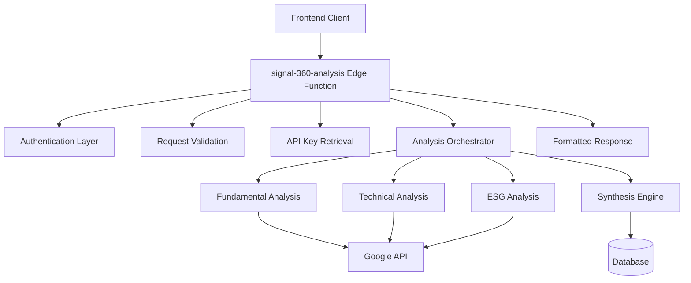

# Design Document

## Overview

The Backend Analysis Logic specification defines the implementation of a comprehensive Supabase Edge Function named `signal-360-analysis` that serves as the primary backend service for financial asset analysis. This function replaces frontend mock data with real analysis capabilities by orchestrating three distinct analysis modules (Fundamental, Technical, and ESG), synthesizing results, and returning structured data compatible with existing frontend components.

The design follows the established patterns in the Signal-360 codebase, leveraging existing shared utilities for authentication, error handling, security, and database operations while introducing new analysis-specific logic.

## Architecture

### High-Level Architecture



### Request Flow

1. **Authentication & Validation**: Validate JWT token and request parameters
2. **API Key Retrieval**: Securely fetch and decrypt user's Google API key
3. **Analysis Orchestration**: Execute three analysis modules concurrently
4. **Data Synthesis**: Combine analysis results with context-aware weighting
5. **Response Formatting**: Transform results to match frontend component interfaces
6. **Database Storage**: Persist analysis results for future reference

### Security Architecture

- **Authentication**: JWT token validation using Supabase Auth
- **Authorization**: Row-level security for database operations
- **API Key Security**: Encrypted storage and secure retrieval
- **Input Validation**: Comprehensive sanitization and validation
- **Rate Limiting**: Analysis request throttling per user
- **Error Handling**: Structured error responses without data leakage

## Components and Interfaces

### Core Edge Function Interface

```typescript
// Request Interface
interface AnalysisRequest {
  ticker: string;           // Stock ticker symbol (e.g., "AAPL")
  context: "investment" | "trading";  // Analysis context
}

// Response Interface  
interface AnalysisResponse {
  success: boolean;
  data?: {
    synthesisScore: number;           // 0-100 score
    recommendation: "BUY" | "SELL" | "HOLD";
    convergenceFactors: string[];     // Supporting factors
    divergenceFactors: string[];      // Risk factors
    analysisId: number;              // Database record ID
  };
  error?: {
    code: string;
    message: string;
    details?: string;
  };
}
```

### Analysis Orchestrator

The `AnalysisOrchestrator` class manages the complete analysis workflow:

```typescript
class AnalysisOrchestrator {
  // Core orchestration method
  async executeAnalysis(request: AnalysisRequest, userId: string): Promise<AnalysisResult>
  
  // Individual analysis execution
  private async executeFundamentalAnalysis(input: AnalysisInput): Promise<FundamentalOutput>
  private async executeTechnicalAnalysis(input: AnalysisInput): Promise<TechnicalOutput>
  private async executeESGAnalysis(input: AnalysisInput): Promise<ESGOutput>
  
  // Result synthesis and storage
  private async synthesizeResults(results: AnalysisResults): Promise<SynthesisOutput>
  private async storeResults(userId: string, results: SynthesisOutput): Promise<number>
}
```

### Google API Integration Layer

```typescript
interface GoogleAPIClient {
  // Fundamental data retrieval
  async getFinancialData(ticker: string): Promise<FinancialData>
  async getCompanyMetrics(ticker: string): Promise<CompanyMetrics>
  
  // Technical data retrieval  
  async getPriceHistory(ticker: string, timeframe: string): Promise<PriceData[]>
  async getTechnicalIndicators(ticker: string): Promise<TechnicalIndicators>
  
  // ESG data retrieval
  async getESGScores(ticker: string): Promise<ESGData>
  async getSustainabilityMetrics(ticker: string): Promise<SustainabilityData>
}
```

### Data Transformation Layer

```typescript
interface DataTransformer {
  // Transform raw API data to analysis format
  transformFundamentalData(rawData: any): FundamentalAnalysisOutput
  transformTechnicalData(rawData: any): TechnicalAnalysisOutput  
  transformESGData(rawData: any): ESGAnalysisOutput
  
  // Transform analysis results to frontend format
  transformToFrontendFormat(synthesis: SynthesisOutput): AnalysisResponse['data']
}
```

## Data Models

### Analysis Input Models

```typescript
interface FundamentalAnalysisInput {
  ticker_symbol: string;
  api_key: string;
  analysis_context: "investment" | "trading";
}

interface TechnicalAnalysisInput extends FundamentalAnalysisInput {
  trading_timeframe?: string;  // Required for trading context
}

interface ESGAnalysisInput extends FundamentalAnalysisInput {}
```

### Analysis Output Models

```typescript
interface FundamentalAnalysisOutput {
  score: number;  // 0-100
  factors: AnalysisFactor[];
  details: {
    financial_ratios: Record<string, number>;
    growth_metrics: Record<string, number>;
    valuation_metrics: Record<string, number>;
    quality_indicators: Record<string, number>;
  };
  confidence: number;  // 0-1
}

interface TechnicalAnalysisOutput {
  score: number;  // 0-100
  factors: AnalysisFactor[];
  details: {
    trend_indicators: Record<string, number>;
    momentum_indicators: Record<string, number>;
    volume_indicators: Record<string, number>;
    support_resistance: {
      support_levels: number[];
      resistance_levels: number[];
    };
  };
  confidence: number;  // 0-1
}

interface ESGAnalysisOutput {
  score: number;  // 0-100
  factors: AnalysisFactor[];
  details: {
    environmental_score: number;
    social_score: number;
    governance_score: number;
    sustainability_metrics: Record<string, number>;
  };
  confidence: number;  // 0-1
}
```

### Synthesis Models

```typescript
interface SynthesisInput {
  ticker_symbol: string;
  analysis_context: "investment" | "trading";
  fundamental_result: FundamentalAnalysisOutput;
  technical_result: TechnicalAnalysisOutput;
  esg_result: ESGAnalysisOutput;
}

interface SynthesisOutput {
  synthesis_score: number;  // 0-100
  recommendation: "BUY" | "SELL" | "HOLD";
  convergence_factors: string[];
  divergence_factors: string[];
  confidence: number;  // 0-1
  analysis_timestamp: string;
}
```

### Frontend Compatibility Models

The response must match the existing frontend component interfaces:

```typescript
// AnalysisChart component expects
interface ChartDataPoint {
  name: string;
  value: number;
  category?: string;
  benchmark?: number;
}

// ResultsView component expects
interface AnalysisResult {
  synthesisScore: number;
  recommendation: "BUY" | "SELL" | "HOLD";
  convergenceFactors: string[];
  divergenceFactors: string[];
}
```

## Error Handling

### Error Classification

1. **Client Errors (4xx)**
   - `INVALID_REQUEST`: Malformed request body
   - `INVALID_TICKER`: Invalid ticker symbol format
   - `MISSING_API_KEY`: User hasn't configured API key
   - `MISSING_TOKEN`: No authentication token provided

2. **Server Errors (5xx)**
   - `PROCESSING_ERROR`: Analysis execution failure
   - `DATABASE_ERROR`: Database operation failure
   - `EXTERNAL_API_ERROR`: Google API failure
   - `DECRYPTION_ERROR`: API key decryption failure

3. **External Service Errors (502/503/504)**
   - `RATE_LIMIT_EXCEEDED`: API rate limits hit
   - `SERVICE_UNAVAILABLE`: External service down
   - `API_TIMEOUT`: Request timeout

### Error Response Format

```typescript
interface ErrorResponse {
  success: false;
  error: {
    code: string;
    message: string;
    details?: string;
    retry_after?: number;  // For rate limit errors
  };
  request_id: string;
  timestamp: string;
}
```

### Retry Strategy

- **Exponential Backoff**: For transient failures
- **Circuit Breaker**: For persistent external service failures  
- **Timeout Handling**: 2-minute timeout for complete analysis
- **Graceful Degradation**: Continue with partial results when possible

## Testing Strategy

### Unit Testing

1. **Authentication Tests**
   - Valid JWT token validation
   - Invalid/expired token handling
   - Missing token scenarios

2. **Validation Tests**
   - Request parameter validation
   - Ticker symbol format validation
   - Context parameter validation

3. **Analysis Module Tests**
   - Individual analysis function execution
   - Error handling for each module
   - Data transformation accuracy

4. **Synthesis Tests**
   - Context-aware weighting logic
   - Score calculation algorithms
   - Factor identification accuracy

### Integration Testing

1. **End-to-End Analysis Flow**
   - Complete analysis workflow
   - Database integration
   - External API integration

2. **Error Scenario Testing**
   - Network failures
   - API rate limiting
   - Invalid API keys
   - Database connection issues

3. **Performance Testing**
   - Concurrent analysis requests
   - Large dataset processing
   - Memory usage optimization

### Security Testing

1. **Authentication Security**
   - JWT token validation
   - Authorization bypass attempts
   - Session management

2. **Input Validation Security**
   - SQL injection prevention
   - XSS prevention
   - Parameter tampering

3. **API Key Security**
   - Encryption/decryption validation
   - Key exposure prevention
   - Secure transmission

### Load Testing

1. **Concurrent Users**
   - Multiple simultaneous analysis requests
   - Resource contention handling
   - Rate limiting effectiveness

2. **External API Limits**
   - Google API rate limit handling
   - Quota management
   - Fallback strategies

## Implementation Considerations

### Performance Optimization

1. **Concurrent Execution**: Run all three analysis modules in parallel
2. **Caching Strategy**: Cache analysis results for repeated requests
3. **Connection Pooling**: Reuse HTTP connections for external APIs
4. **Memory Management**: Efficient data structure usage

### Security Considerations

1. **API Key Protection**: Never log or expose API keys
2. **Input Sanitization**: Validate and sanitize all inputs
3. **Rate Limiting**: Prevent abuse and manage costs
4. **Audit Logging**: Track analysis requests for security monitoring

### Scalability Considerations

1. **Stateless Design**: No server-side state management
2. **Database Optimization**: Efficient queries and indexing
3. **External API Management**: Handle rate limits and quotas
4. **Error Recovery**: Graceful handling of partial failures

### Monitoring and Observability

1. **Request Tracking**: Unique request IDs for tracing
2. **Performance Metrics**: Execution time and resource usage
3. **Error Monitoring**: Structured error logging and alerting
4. **Business Metrics**: Analysis success rates and user patterns

## Dependencies

### External Dependencies

1. **Supabase Edge Functions Runtime**: Deno-based execution environment
2. **Google API**: Financial data source (requires user API keys)
3. **Supabase Database**: PostgreSQL for data persistence
4. **Supabase Auth**: JWT token validation

### Internal Dependencies

1. **Shared Utilities**: Authentication, validation, error handling
2. **Database Services**: Profile and analysis data access
3. **Security Middleware**: Rate limiting and input validation
4. **Logging Framework**: Structured logging and monitoring

### Configuration Requirements

1. **Environment Variables**:
   - `SUPABASE_URL`: Supabase project URL
   - `SUPABASE_ANON_KEY`: Public API key
   - `SUPABASE_SERVICE_ROLE_KEY`: Service role key
   - `GOOGLE_API_TIMEOUT`: API request timeout (default: 30s)
   - `ANALYSIS_TIMEOUT`: Total analysis timeout (default: 120s)

2. **Database Schema**: Profiles and analyses tables with proper RLS policies

3. **Security Configuration**: Rate limits, CORS settings, security headers