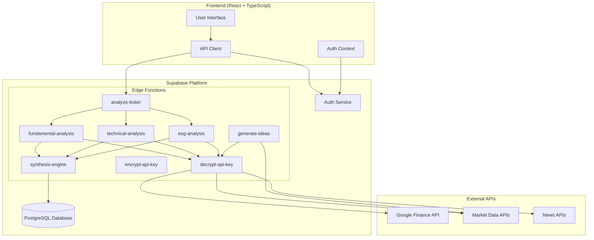

# Design Document

## Overview

The Backend Analysis Logic for Signal-360 is implemented as a suite of Supabase Edge Functions that provide secure, scalable financial analysis capabilities. The system orchestrates three specialized analysis modules (Fundamental, Technical, ESG) and synthesizes their outputs into actionable investment insights. All processing occurs server-side to ensure security, protect API keys, and maintain consistent performance.

The architecture follows a microservices pattern with dedicated Edge Functions for different responsibilities, enabling independent scaling and maintenance while maintaining cohesive functionality through shared utilities and standardized interfaces.

## Architecture

### High-Level Architecture



### Edge Functions Architecture

The system consists of eight specialized Edge Functions:

1. **analyze-ticker** - Main orchestrator function
2. **fundamental-analysis** - Financial fundamentals analysis
3. **technical-analysis** - Price and volume analysis
4. **esg-analysis** - Environmental, social, governance analysis
5. **synthesis-engine** - Results combination and scoring
6. **generate-ideas** - Ticker suggestion engine
7. **encrypt-api-key** - API key encryption service
8. **decrypt-api-key** - API key decryption service

## Components and Interfaces

### 1. Main Orchestrator Function (analyze-ticker)

**Purpose**: Coordinates the entire analysis workflow and manages concurrent execution of analysis modules.

**Interface**:
```typescript
interface AnalysisRequest {
  ticker_symbol: string;
  analysis_context: 'investment' | 'trading';
  trading_timeframe?: string; // Required for trading context
}

interface AnalysisResponse {
  success: boolean;
  data?: {
    analysis_id: number;
    ticker_symbol: string;
    synthesis_score: number;
    convergence_factors: ConvergenceFactor[];
    divergence_factors: DivergenceFactor[];
    full_report: AnalysisReport;
  };
  error?: {
    code: string;
    message: string;
    details?: string;
  };
}
```

**Key Responsibilities**:
- Request validation and sanitization
- User authentication and API key retrieval
- Concurrent execution of analysis modules
- Error handling and response formatting
- Result persistence to database

### 2. Analysis Modules

#### Fundamental Analysis Module

**Purpose**: Analyzes company financials, ratios, and business fundamentals.

**Interface**:
```typescript
interface FundamentalAnalysisInput {
  ticker_symbol: string;
  api_key: string;
  analysis_context: 'investment' | 'trading';
}

interface FundamentalAnalysisOutput {
  score: number; // 0-100
  factors: AnalysisFactor[];
  details: {
    financial_ratios: Record<string, number>;
    growth_metrics: Record<string, number>;
    valuation_metrics: Record<string, number>;
    quality_indicators: Record<string, number>;
  };
  confidence: number; // 0-1
}
```

#### Technical Analysis Module

**Purpose**: Analyzes price patterns, indicators, and market trends.

**Interface**:
```typescript
interface TechnicalAnalysisInput {
  ticker_symbol: string;
  api_key: string;
  analysis_context: 'investment' | 'trading';
  trading_timeframe?: string;
}

interface TechnicalAnalysisOutput {
  score: number; // 0-100
  factors: AnalysisFactor[];
  details: {
    trend_indicators: Record<string, number>;
    momentum_indicators: Record<string, number>;
    volume_indicators: Record<string, number>;
    support_resistance: {
      support_levels: number[];
      resistance_levels: number[];
    };
  };
  confidence: number; // 0-1
}
```

#### ESG Analysis Module

**Purpose**: Evaluates environmental, social, and governance factors.

**Interface**:
```typescript
interface ESGAnalysisInput {
  ticker_symbol: string;
  api_key: string;
  analysis_context: 'investment' | 'trading';
}

interface ESGAnalysisOutput {
  score: number; // 0-100
  factors: AnalysisFactor[];
  details: {
    environmental_score: number;
    social_score: number;
    governance_score: number;
    sustainability_metrics: Record<string, number>;
  };
  confidence: number; // 0-1
}
```

### 3. Synthesis Engine

**Purpose**: Combines analysis results with context-aware weighting to generate final insights.

**Interface**:
```typescript
interface SynthesisInput {
  ticker_symbol: string;
  analysis_context: 'investment' | 'trading';
  trading_timeframe?: string;
  fundamental_result: FundamentalAnalysisOutput;
  technical_result: TechnicalAnalysisOutput;
  esg_result: ESGAnalysisOutput;
}

interface SynthesisOutput {
  synthesis_score: number; // 0-100
  convergence_factors: ConvergenceFactor[];
  divergence_factors: DivergenceFactor[];
  full_report: AnalysisReport;
  confidence: number; // 0-1
}
```

**Weighting Strategy**:
- **Investment Context**: Fundamental (50%), ESG (30%), Technical (20%)
- **Trading Context**: Technical (60%), Fundamental (25%), ESG (15%)
- **Timeframe Adjustments**: Shorter timeframes increase technical weighting

### 4. Idea Generation Function

**Purpose**: Generates ticker suggestions based on market screening criteria.

**Interface**:
```typescript
interface IdeaGenerationRequest {
  context: 'investment_idea' | 'trade_idea';
  timeframe?: string; // For trade ideas
}

interface IdeaGenerationResponse {
  success: boolean;
  data?: {
    ticker_symbol: string;
    company_name: string;
    justification: string;
    confidence: number;
  };
  error?: {
    code: string;
    message: string;
  };
}
```

### 5. Encryption Services

**Purpose**: Secure handling of user API keys with encryption/decryption capabilities.

**Interface**:
```typescript
interface EncryptionRequest {
  api_key: string;
}

interface EncryptionResponse {
  success: boolean;
  encrypted_key?: string;
  error?: string;
}

interface DecryptionRequest {
  encrypted_key: string;
}

interface DecryptionResponse {
  success: boolean;
  api_key?: string;
  error?: string;
}
```

## Data Models

### Core Analysis Data Structures

```typescript
interface AnalysisFactor {
  category: 'fundamental' | 'technical' | 'esg';
  type: 'positive' | 'negative';
  description: string;
  weight: number; // 0-1
  confidence: number; // 0-1
  metadata?: Record<string, any>;
}

interface ConvergenceFactor {
  category: string;
  description: string;
  weight: number;
  supporting_analyses: string[]; // Which analyses support this factor
  metadata?: Record<string, any>;
}

interface DivergenceFactor {
  category: string;
  description: string;
  weight: number;
  conflicting_analyses: string[]; // Which analyses conflict
  metadata?: Record<string, any>;
}

interface AnalysisReport {
  summary: string;
  recommendation: 'strong_buy' | 'buy' | 'hold' | 'sell' | 'strong_sell';
  fundamental?: FundamentalAnalysisOutput;
  technical?: TechnicalAnalysisOutput;
  esg?: ESGAnalysisOutput;
  synthesis_methodology: string;
  limitations: string[];
  metadata: {
    analysis_timestamp: string;
    data_sources: string[];
    api_version: string;
  };
}
```

### Database Integration

The system integrates with existing database schema:

```sql
-- Analyses table (existing)
CREATE TABLE analyses (
  id SERIAL PRIMARY KEY,
  user_id UUID REFERENCES profiles(id),
  created_at TIMESTAMPTZ DEFAULT NOW(),
  ticker_symbol TEXT NOT NULL,
  analysis_context TEXT CHECK (analysis_context IN ('investment', 'trading')),
  trading_timeframe TEXT,
  synthesis_score INTEGER CHECK (synthesis_score >= 0 AND synthesis_score <= 100),
  convergence_factors JSONB NOT NULL,
  divergence_factors JSONB NOT NULL,
  full_report JSONB NOT NULL
);

-- Profiles table (existing)
CREATE TABLE profiles (
  id UUID PRIMARY KEY REFERENCES auth.users(id),
  encrypted_google_api_key TEXT,
  created_at TIMESTAMPTZ DEFAULT NOW(),
  updated_at TIMESTAMPTZ DEFAULT NOW()
);
```

## Error Handling

### Error Classification

1. **Validation Errors** (400)
   - Invalid ticker symbols
   - Missing required parameters
   - Invalid analysis context

2. **Authentication Errors** (401)
   - Missing or invalid JWT token
   - Expired session

3. **Authorization Errors** (403)
   - Missing API key
   - Invalid API key format

4. **External API Errors** (502/503)
   - API rate limits exceeded
   - External service unavailable
   - Invalid API responses

5. **Internal Errors** (500)
   - Database connection failures
   - Unexpected processing errors

### Error Response Format

```typescript
interface ErrorResponse {
  success: false;
  error: {
    code: string;
    message: string;
    details?: string;
    retry_after?: number; // For rate limit errors
  };
  request_id: string;
  timestamp: string;
}
```

### Retry Strategy

- **External API Calls**: Exponential backoff with jitter (1s, 2s, 4s)
- **Database Operations**: Linear retry with 500ms intervals
- **Rate Limits**: Respect retry-after headers
- **Circuit Breaker**: Fail fast after 3 consecutive failures

## Testing Strategy

### Unit Testing

Each Edge Function includes comprehensive unit tests:

```typescript
// Example test structure
describe('analyze-ticker', () => {
  describe('input validation', () => {
    it('should reject invalid ticker symbols');
    it('should require trading_timeframe for trading context');
    it('should validate analysis_context values');
  });

  describe('analysis orchestration', () => {
    it('should execute all analysis modules concurrently');
    it('should handle partial failures gracefully');
    it('should aggregate results correctly');
  });

  describe('error handling', () => {
    it('should handle external API failures');
    it('should handle database connection errors');
    it('should return structured error responses');
  });
});
```

### Integration Testing

- **End-to-end analysis workflows**
- **Database integration tests**
- **External API integration tests**
- **Authentication and authorization flows**

### Performance Testing

- **Load testing with concurrent requests**
- **Memory usage monitoring**
- **Response time benchmarking**
- **Rate limit handling validation**

### Security Testing

- **API key encryption/decryption validation**
- **Input sanitization verification**
- **Authentication bypass attempts**
- **SQL injection prevention**

## Performance Considerations

### Optimization Strategies

1. **Concurrent Execution**
   - Analysis modules run in parallel
   - Database queries optimized with indexes
   - Connection pooling for external APIs

2. **Caching Strategy**
   - Market data cached for 5 minutes
   - Company fundamentals cached for 1 hour
   - ESG data cached for 24 hours

3. **Resource Management**
   - Request timeouts (30 seconds per module)
   - Memory limits per function
   - Connection pooling

4. **Data Efficiency**
   - Selective data fetching
   - Compressed API responses
   - Optimized JSON structures

### Monitoring and Observability

- **Request/response logging**
- **Performance metrics collection**
- **Error rate monitoring**
- **External API usage tracking**
- **Database query performance**

## Security Architecture

### API Key Management

1. **Encryption at Rest**
   - AES-256 encryption using Supabase vault
   - Keys never stored in plain text
   - Automatic key rotation capability

2. **Encryption in Transit**
   - TLS 1.3 for all communications
   - Certificate pinning for external APIs
   - Encrypted internal function calls

3. **Access Control**
   - JWT-based authentication
   - Row-level security (RLS) policies
   - Function-level authorization

### Input Validation

```typescript
// Example validation schema
const AnalysisRequestSchema = {
  ticker_symbol: {
    type: 'string',
    pattern: '^[A-Z]{1,5}$',
    required: true
  },
  analysis_context: {
    type: 'string',
    enum: ['investment', 'trading'],
    required: true
  },
  trading_timeframe: {
    type: 'string',
    pattern: '^(1D|1W|1M|3M|6M|1Y)$',
    required: false
  }
};
```

### Rate Limiting

- **Per-user limits**: 100 requests/hour
- **Per-IP limits**: 1000 requests/hour
- **Burst protection**: 10 requests/minute
- **API key usage tracking**

## Deployment and Scaling

### Edge Function Deployment

```typescript
// supabase/functions/analyze-ticker/index.ts
import { serve } from 'https://deno.land/std@0.168.0/http/server.ts';
import { createClient } from 'https://esm.sh/@supabase/supabase-js@2';

serve(async (req) => {
  // Function implementation
});
```

### Environment Configuration

```typescript
// Environment variables
const config = {
  SUPABASE_URL: Deno.env.get('SUPABASE_URL'),
  SUPABASE_ANON_KEY: Deno.env.get('SUPABASE_ANON_KEY'),
  SUPABASE_SERVICE_ROLE_KEY: Deno.env.get('SUPABASE_SERVICE_ROLE_KEY'),
  ENCRYPTION_KEY: Deno.env.get('ENCRYPTION_KEY'),
  EXTERNAL_API_TIMEOUT: parseInt(Deno.env.get('EXTERNAL_API_TIMEOUT') || '30000'),
};
```

### Scaling Considerations

- **Horizontal scaling**: Edge Functions auto-scale
- **Database scaling**: Connection pooling and read replicas
- **External API limits**: Rate limiting and caching
- **Cost optimization**: Function cold start minimization