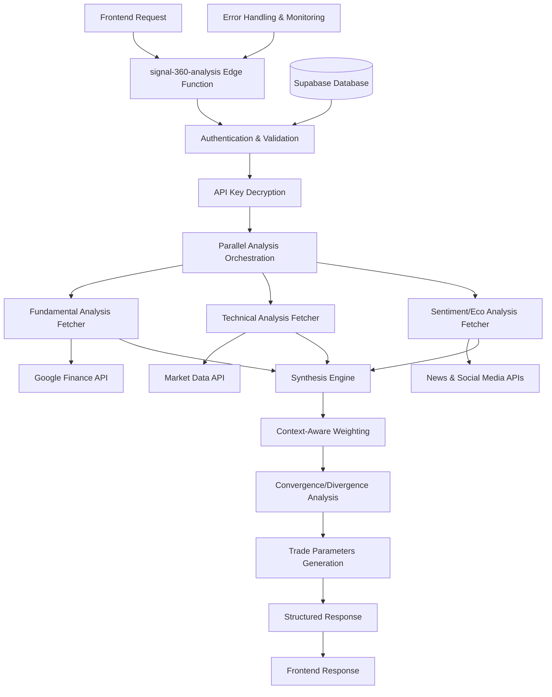

# Design Document

## Overview

The Backend Core Analysis Logic v2 represents a complete transformation of Signal-360's analysis pipeline from a prototype system with placeholder logic into a production-ready, fully functional backend service. This design builds upon the existing Supabase Edge Function architecture while implementing real data fetching, comprehensive analysis processing, and intelligent synthesis capabilities.

The system will replace the current `signal-360-analysis` function with a robust orchestrator that coordinates three specialized analysis modules (fundamental, technical, and sentiment/eco), processes their outputs through an enhanced synthesis engine, and returns structured, actionable investment insights to the frontend.

## Architecture

### High-Level Architecture



### Component Architecture

The system follows a modular, service-oriented architecture with clear separation of concerns:

1. **Master Orchestrator**: The main `signal-360-analysis` function that coordinates all operations
2. **Analysis Fetchers**: Three specialized modules for data retrieval and processing
3. **Synthesis Engine**: Enhanced version of the existing synthesis engine with real data processing
4. **Response Formatter**: Ensures consistent, structured output matching the specified schema

### Data Flow

1. **Request Processing**: Validate ticker, context, and user authentication
2. **Parallel Data Fetching**: Simultaneously retrieve fundamental, technical, and sentiment data
3. **Individual Analysis**: Process raw data into scored analysis results
4. **Synthesis**: Apply context-aware weighting and identify convergence/divergence patterns
5. **Response Generation**: Format results into the specified JSON structure

## Components and Interfaces

### Master Orchestrator Function

**Location**: `supabase/functions/signal-360-analysis/index.ts`

**Responsibilities**:
- Request validation and authentication
- API key decryption and management
- Parallel analysis coordination
- Error handling and response formatting
- Performance monitoring and logging

**Key Methods**:
```typescript
async function handleAnalysisRequest(request: Request): Promise<Response>
async function orchestrateAnalysis(ticker: string, context: string, apiKey: string): Promise<AnalysisResult>
async function validateAndDecryptApiKey(userId: string): Promise<string>
```

### Fundamental Analysis Fetcher

**Enhancement of**: `supabase/functions/fundamental-analysis/index.ts`

**New Capabilities**:
- Real Google Finance API integration
- Enhanced financial ratio calculations
- Industry comparison metrics
- Earnings quality assessment
- Management effectiveness indicators

**Data Sources**:
- Google Finance API for financial statements
- Market data for valuation metrics
- Industry benchmarks for comparative analysis

### Technical Analysis Fetcher

**Enhancement of**: `supabase/functions/technical-analysis/index.ts`

**New Capabilities**:
- Context-aware timeframe selection
- Advanced pattern recognition
- Volume analysis integration
- Support/resistance level calculation
- Momentum indicator synthesis

**Context-Specific Behavior**:
- **Investment Context**: Focus on longer-term trends, 200-day moving averages, monthly patterns
- **Trading Context**: Emphasize short-term signals, intraday patterns, volatility measures

### Sentiment/Eco Analysis Fetcher

**New Component**: `supabase/functions/sentiment-eco-analysis/index.ts`

**Capabilities**:
- News sentiment analysis using Google News API
- Social media sentiment tracking
- Market buzz quantification
- Event impact assessment
- Sentiment trend analysis

**Data Sources**:
- Google News API for recent news articles
- Social media APIs for sentiment tracking
- Financial news aggregators
- Earnings call transcripts (when available)

### Enhanced Synthesis Engine

**Enhancement of**: `supabase/functions/synthesis-engine/index.ts`

**New Features**:
- Real data processing (replacing placeholder logic)
- Enhanced convergence/divergence detection
- Trade parameter calculation
- Confidence scoring improvements
- Context-aware recommendation generation

**Weighting Algorithms**:
- **Investment Context**: Fundamental (50%), Sentiment/Eco (30%), Technical (20%)
- **Trading Context**: Technical (60%), Fundamental (25%), Sentiment/Eco (15%)

### Response Formatter

**New Component**: Integrated into master orchestrator

**Responsibilities**:
- Ensure response matches exact JSON schema
- Calculate trade parameters (entry, stop-loss, take-profit)
- Format key eco factors with proper attribution
- Generate comprehensive full report structure

## Data Models

### Enhanced Analysis Input

```typescript
interface Signal360AnalysisInput {
  ticker: string;
  context: 'investment' | 'trading';
  user_id: string;
  api_key: string; // Decrypted
}
```

### Individual Analysis Results

```typescript
interface FundamentalAnalysisResult {
  score: number; // 0-100
  factors: AnalysisFactor[];
  details: {
    financial_ratios: Record<string, number>;
    growth_metrics: Record<string, number>;
    valuation_metrics: Record<string, number>;
    quality_indicators: Record<string, number>;
  };
  confidence: number; // 0-1
  data_sources: string[];
}

interface TechnicalAnalysisResult {
  score: number; // 0-100
  factors: AnalysisFactor[];
  details: {
    trend_indicators: Record<string, number>;
    momentum_indicators: Record<string, number>;
    volume_indicators: Record<string, number>;
    support_resistance: {
      support_levels: number[];
      resistance_levels: number[];
    };
  };
  confidence: number; // 0-1
  timeframe_used: string;
}

interface SentimentEcoAnalysisResult {
  score: number; // 0-100
  factors: AnalysisFactor[];
  details: {
    news_sentiment: number; // -1 to 1
    social_sentiment: number; // -1 to 1
    market_buzz: number; // 0-100
    recent_events: NewsEvent[];
  };
  confidence: number; // 0-1
  key_ecos: EcoFactor[];
}
```

### Final Response Schema

```typescript
interface Signal360AnalysisResponse {
  synthesis_score: number; // 0-100
  recommendation: 'BUY' | 'SELL' | 'HOLD';
  confidence: number; // 0-100
  convergence_factors: string[];
  divergence_factors: string[];
  trade_parameters: {
    entry_price: number;
    stop_loss: number;
    take_profit_levels: number[];
  };
  key_ecos: Array<{
    source: string;
    headline: string;
    sentiment: 'positive' | 'negative' | 'neutral';
  }>;
  full_report: {
    fundamental: {
      score: number;
      summary: string;
    };
    technical: {
      score: number;
      summary: string;
    };
    sentiment_eco: {
      score: number;
      summary: string;
    };
  };
}
```

## Error Handling

### Error Categories

1. **Authentication Errors**: Invalid JWT, missing API key
2. **Validation Errors**: Invalid ticker format, unsupported context
3. **External API Errors**: Rate limits, service unavailability, invalid responses
4. **Processing Errors**: Insufficient data, calculation failures
5. **System Errors**: Database connectivity, memory issues

### Error Response Strategy

```typescript
interface ErrorResponse {
  success: false;
  error: {
    code: string;
    message: string;
    details?: string;
    retry_after?: number; // For rate limit errors
  };
  request_id: string;
  timestamp: string;
}
```

### Resilience Patterns

1. **Circuit Breaker**: Prevent cascading failures from external APIs
2. **Retry with Exponential Backoff**: Handle transient failures
3. **Graceful Degradation**: Return partial results when possible
4. **Timeout Management**: Prevent hanging requests
5. **Rate Limit Handling**: Respect API quotas and implement queuing

## Testing Strategy

### Unit Testing

- **Analysis Fetchers**: Mock external API responses, test calculation logic
- **Synthesis Engine**: Test weighting algorithms, convergence/divergence detection
- **Response Formatter**: Validate output schema compliance
- **Error Handlers**: Test all error scenarios and response formats

### Integration Testing

- **End-to-End Analysis Flow**: Test complete pipeline with real API calls
- **Database Integration**: Test user authentication and API key retrieval
- **External API Integration**: Test with various ticker symbols and market conditions
- **Performance Testing**: Measure response times under load

### Test Data Strategy

- **Mock Data Sets**: Comprehensive test data for various market scenarios
- **Sandbox APIs**: Use test endpoints where available
- **Error Simulation**: Test failure scenarios and recovery mechanisms
- **Load Testing**: Simulate concurrent user requests

### Testing Environment

- **Local Development**: Use environment variables for API keys and database connections
- **Staging Environment**: Mirror production setup with test data
- **Production Monitoring**: Real-time error tracking and performance metrics

## Performance Considerations

### Optimization Strategies

1. **Parallel Processing**: Execute all three analyses simultaneously
2. **Caching**: Cache frequently requested ticker data (with appropriate TTL)
3. **Connection Pooling**: Reuse database and API connections
4. **Response Compression**: Minimize payload size
5. **Lazy Loading**: Only fetch detailed data when needed

### Scalability Measures

1. **Horizontal Scaling**: Edge functions auto-scale based on demand
2. **Rate Limiting**: Implement user-level rate limits to prevent abuse
3. **Queue Management**: Handle burst traffic with request queuing
4. **Resource Monitoring**: Track memory and CPU usage
5. **Database Optimization**: Efficient queries and indexing

### Performance Targets

- **Response Time**: < 10 seconds for complete analysis
- **Availability**: 99.9% uptime
- **Throughput**: Support 100+ concurrent analyses
- **Error Rate**: < 1% for valid requests

## Security Considerations

### Data Protection

1. **API Key Encryption**: Secure storage and transmission of user API keys
2. **Input Validation**: Sanitize all user inputs to prevent injection attacks
3. **Authentication**: Verify JWT tokens for all requests
4. **Authorization**: Ensure users can only access their own data
5. **Audit Logging**: Track all analysis requests and outcomes

### External API Security

1. **Key Rotation**: Support for API key updates without service interruption
2. **Rate Limit Compliance**: Respect external API quotas and terms
3. **Secure Communication**: Use HTTPS for all external API calls
4. **Error Information**: Avoid exposing sensitive data in error messages
5. **Monitoring**: Detect and alert on suspicious activity patterns

## Monitoring and Observability

### Metrics Collection

1. **Request Metrics**: Count, duration, success/failure rates
2. **Analysis Metrics**: Individual component performance and accuracy
3. **External API Metrics**: Response times, error rates, quota usage
4. **Business Metrics**: User engagement, analysis quality scores
5. **System Metrics**: Memory usage, CPU utilization, error rates

### Logging Strategy

1. **Structured Logging**: JSON format for easy parsing and analysis
2. **Request Tracing**: Unique request IDs for end-to-end tracking
3. **Error Logging**: Detailed error information for debugging
4. **Performance Logging**: Track slow operations and bottlenecks
5. **Security Logging**: Authentication failures and suspicious activity

### Alerting

1. **Error Rate Alerts**: Notify when error rates exceed thresholds
2. **Performance Alerts**: Alert on slow response times or high resource usage
3. **External API Alerts**: Monitor API quota usage and failures
4. **Business Alerts**: Track analysis quality and user satisfaction
5. **Security Alerts**: Detect potential security incidents

This design provides a comprehensive foundation for transforming Signal-360's backend analysis logic from a prototype into a production-ready system that delivers real, actionable investment insights to users.