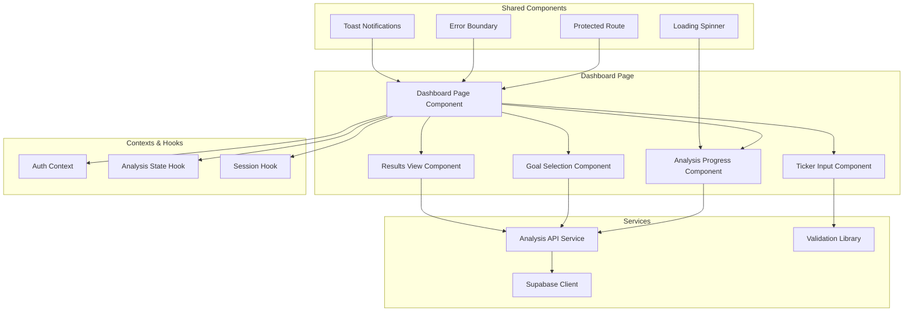
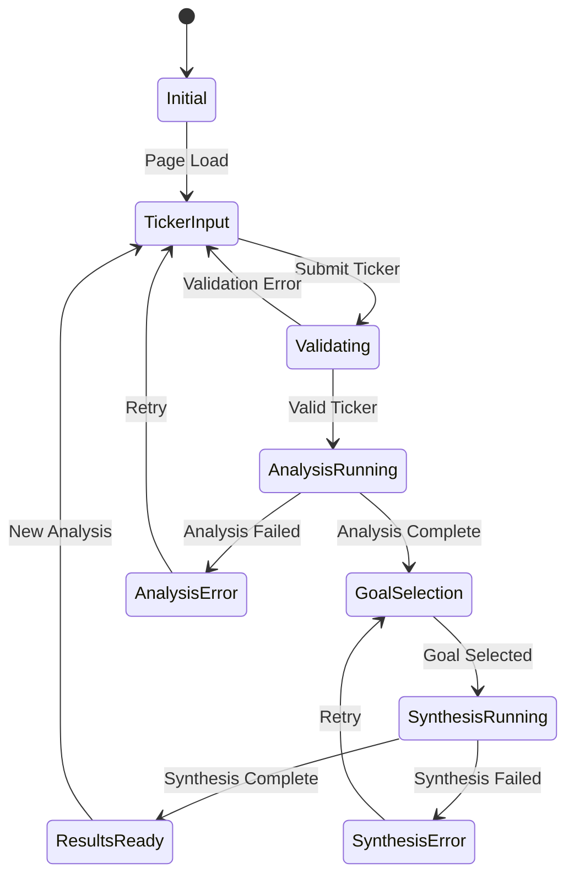
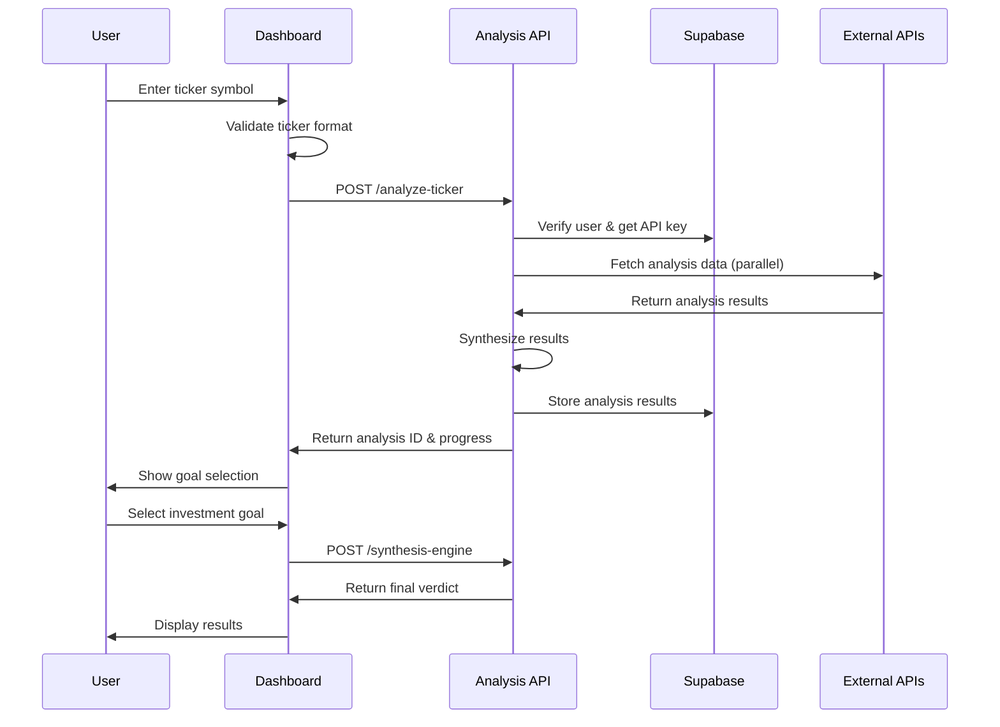

# Design Document

## Overview

The main dashboard page serves as the central hub of Signal-360, providing users with a streamlined interface to perform comprehensive financial analysis. The design integrates seamlessly with the existing authentication system and backend analysis logic, creating a cohesive user experience that transforms complex financial data into actionable insights.

The dashboard follows a progressive disclosure pattern, guiding users through a three-stage workflow: ticker input → analysis execution → results presentation. This approach minimizes cognitive load while maximizing the value delivered through the unified analysis platform.

## Architecture

### Component Architecture



### State Management Flow



### Data Flow Architecture



## Components and Interfaces

### 1. Dashboard Page Component

**Purpose**: Main container component that orchestrates the analysis workflow and manages overall page state.

**Interface**:
```typescript
interface DashboardPageProps {}

interface DashboardState {
  currentStep: 'input' | 'analysis' | 'goal-selection' | 'synthesis' | 'results';
  tickerSymbol: string;
  analysisId: number | null;
  analysisProgress: AnalysisProgress;
  goalSelection: 'investment' | 'trading' | null;
  tradingTimeframe: string | null;
  results: AnalysisResults | null;
  error: DashboardError | null;
  loading: boolean;
}
```

**Key Responsibilities**:
- Coordinate workflow state transitions
- Handle error boundaries and recovery
- Manage loading states across components
- Integrate with authentication context
- Provide responsive layout structure

### 2. Ticker Input Component

**Purpose**: Provides an intuitive interface for users to input and validate ticker symbols.

**Interface**:
```typescript
interface TickerInputProps {
  onSubmit: (ticker: string) => void;
  loading: boolean;
  error: string | null;
}

interface TickerInputState {
  value: string;
  isValid: boolean;
  suggestions: TickerSuggestion[];
  showSuggestions: boolean;
}

interface TickerSuggestion {
  symbol: string;
  name: string;
  exchange: string;
}
```

**Features**:
- Real-time ticker validation with regex patterns
- Auto-complete suggestions via generate-ideas API
- Clear error messaging for invalid inputs
- Accessibility support with ARIA labels
- Mobile-optimized input experience

### 3. Analysis Progress Component

**Purpose**: Displays real-time progress of the multi-stage analysis process with clear visual feedback.

**Interface**:
```typescript
interface AnalysisProgressProps {
  progress: AnalysisProgress;
  onCancel?: () => void;
}

interface AnalysisProgress {
  overall_progress: number; // 0-100
  stages: {
    fundamental: AnalysisStageStatus;
    technical: AnalysisStageStatus;
    esg: AnalysisStageStatus;
    synthesis: AnalysisStageStatus;
  };
  estimated_completion: string; // ISO timestamp
  current_stage: string;
}

interface AnalysisStageStatus {
  status: 'pending' | 'running' | 'completed' | 'failed';
  progress: number; // 0-100
  message: string;
  started_at?: string;
  completed_at?: string;
}
```

**Visual Design**:
- Progress bar with percentage completion
- Stage-by-stage breakdown with icons
- Estimated time remaining
- Cancel option for long-running analyses
- Error state handling with retry options

### 4. Goal Selection Component

**Purpose**: Captures user investment context to enable appropriate analysis weighting.

**Interface**:
```typescript
interface GoalSelectionProps {
  onGoalSelect: (goal: InvestmentGoal) => void;
  loading: boolean;
}

interface InvestmentGoal {
  type: 'investment' | 'trading';
  timeframe?: TradingTimeframe;
  description: string;
}

type TradingTimeframe = '1D' | '1W' | '1M' | '3M' | '6M' | '1Y';
```

**Features**:
- Clear visual distinction between investment and trading goals
- Conditional timeframe selection for trading goals
- Educational tooltips explaining weighting differences
- Quick selection with keyboard shortcuts
- Responsive card-based layout

### 5. Results View Component

**Purpose**: Presents synthesized analysis results with interactive exploration capabilities.

**Interface**:
```typescript
interface ResultsViewProps {
  results: AnalysisResults;
  onNewAnalysis: () => void;
}

interface AnalysisResults {
  ticker_symbol: string;
  synthesis_score: number; // 0-100
  recommendation: 'strong_buy' | 'buy' | 'hold' | 'sell' | 'strong_sell';
  convergence_factors: ConvergenceFactor[];
  divergence_factors: DivergenceFactor[];
  detailed_analysis: {
    fundamental: FundamentalAnalysisOutput;
    technical: TechnicalAnalysisOutput;
    esg: ESGAnalysisOutput;
  };
  confidence: number; // 0-1
  analysis_timestamp: string;
  goal_context: InvestmentGoal;
}
```

**Visual Components**:
- **Score Display**: Large, prominent score with color-coded recommendation
- **Factor Cards**: Expandable cards for convergence/divergence factors
- **Analysis Tabs**: Tabbed interface for detailed breakdowns
- **Charts Integration**: Recharts components for technical analysis visualization
- **Export Options**: PDF/CSV export functionality

## Data Models

### Core Dashboard Types

```typescript
// Main analysis request/response types
interface AnalysisRequest {
  ticker_symbol: string;
  analysis_context: 'investment' | 'trading';
  trading_timeframe?: TradingTimeframe;
}

interface AnalysisResponse {
  success: boolean;
  data?: {
    analysis_id: number;
    progress_url: string;
    estimated_completion: string;
  };
  error?: APIError;
}

// Progress tracking types
interface ProgressResponse {
  analysis_id: number;
  status: 'running' | 'completed' | 'failed';
  progress: AnalysisProgress;
  results?: AnalysisResults;
  error?: APIError;
}

// Error handling types
interface DashboardError {
  type: 'validation' | 'api' | 'network' | 'timeout';
  message: string;
  details?: string;
  recoverable: boolean;
  retry_after?: number;
}

interface APIError {
  code: string;
  message: string;
  details?: string;
  request_id: string;
}
```

### Chart Data Models

```typescript
// For recharts integration
interface TechnicalChartData {
  timestamp: string;
  price: number;
  volume: number;
  sma_20: number;
  sma_50: number;
  rsi: number;
  support_level?: number;
  resistance_level?: number;
}

interface FundamentalChartData {
  metric: string;
  value: number;
  benchmark: number;
  category: 'valuation' | 'growth' | 'profitability' | 'leverage';
}

interface ESGChartData {
  category: 'environmental' | 'social' | 'governance';
  score: number;
  industry_average: number;
  percentile: number;
}
```

## Error Handling

### Error Classification and Recovery

```typescript
class DashboardErrorHandler {
  static handleError(error: any): DashboardError {
    if (error.name === 'ValidationError') {
      return {
        type: 'validation',
        message: 'Please check your input and try again',
        details: error.message,
        recoverable: true
      };
    }
    
    if (error.response?.status === 429) {
      return {
        type: 'api',
        message: 'Rate limit exceeded. Please wait before trying again.',
        details: 'Too many requests',
        recoverable: true,
        retry_after: error.response.headers['retry-after']
      };
    }
    
    if (error.code === 'NETWORK_ERROR') {
      return {
        type: 'network',
        message: 'Connection issue. Please check your internet and retry.',
        details: error.message,
        recoverable: true
      };
    }
    
    return {
      type: 'api',
      message: 'An unexpected error occurred. Please try again.',
      details: error.message,
      recoverable: true
    };
  }
}
```

### User Experience Error Patterns

1. **Inline Validation**: Real-time feedback for ticker input
2. **Toast Notifications**: Non-blocking error messages
3. **Error Boundaries**: Graceful component failure handling
4. **Retry Mechanisms**: Automatic and manual retry options
5. **Fallback States**: Meaningful error states with recovery actions

## Testing Strategy

### Component Testing

```typescript
// Example test structure for Dashboard components
describe('Dashboard Page', () => {
  describe('Ticker Input Flow', () => {
    it('should validate ticker symbols in real-time');
    it('should show suggestions for partial inputs');
    it('should handle invalid ticker submissions');
    it('should trigger analysis on valid submission');
  });

  describe('Analysis Progress', () => {
    it('should display progress updates correctly');
    it('should handle stage failures gracefully');
    it('should allow analysis cancellation');
    it('should show estimated completion times');
  });

  describe('Results Display', () => {
    it('should render synthesis scores correctly');
    it('should expand factor details on interaction');
    it('should display charts with proper data');
    it('should handle missing data gracefully');
  });
});
```

### Integration Testing

- **End-to-end analysis workflow**
- **Authentication integration**
- **API error handling**
- **Responsive design validation**
- **Accessibility compliance**

### Performance Testing

- **Component render performance**
- **Chart rendering optimization**
- **Memory usage monitoring**
- **Bundle size analysis**

## Accessibility Design

### WCAG 2.1 AA Compliance

1. **Keyboard Navigation**
   - Tab order through all interactive elements
   - Enter/Space activation for buttons
   - Escape key for modal dismissal

2. **Screen Reader Support**
   - Semantic HTML structure
   - ARIA labels for complex interactions
   - Live regions for dynamic content updates
   - Alternative text for charts and graphs

3. **Visual Design**
   - High contrast color schemes
   - Scalable text up to 200%
   - Focus indicators for all interactive elements
   - Color-blind friendly chart palettes

4. **Motor Accessibility**
   - Large touch targets (44px minimum)
   - Generous click areas
   - No time-based interactions
   - Alternative input methods support

### Implementation Examples

```typescript
// Accessible ticker input
<label htmlFor="ticker-input" className="sr-only">
  Enter stock ticker symbol
</label>
<input
  id="ticker-input"
  type="text"
  placeholder="Enter ticker (e.g., AAPL)"
  aria-describedby="ticker-help ticker-error"
  aria-invalid={hasError}
  autoComplete="off"
/>

// Live region for progress updates
<div
  role="status"
  aria-live="polite"
  aria-label="Analysis progress"
  className="sr-only"
>
  {progressMessage}
</div>

// Accessible chart alternative
<div role="img" aria-labelledby="chart-title" aria-describedby="chart-desc">
  <Chart data={chartData} />
  <div id="chart-title" className="sr-only">Technical Analysis Chart</div>
  <div id="chart-desc" className="sr-only">
    Price trend showing {trendDescription}
  </div>
</div>
```

## Performance Optimization

### Rendering Optimization

1. **Code Splitting**
   - Lazy load chart components
   - Route-based code splitting
   - Dynamic imports for heavy libraries

2. **State Management**
   - Minimize re-renders with useMemo/useCallback
   - Optimize context provider structure
   - Implement proper dependency arrays

3. **Data Handling**
   - Implement request deduplication
   - Cache analysis results locally
   - Optimize chart data structures

### Bundle Optimization

```typescript
// Lazy loading for chart components
const TechnicalChart = lazy(() => import('./charts/TechnicalChart'));
const FundamentalChart = lazy(() => import('./charts/FundamentalChart'));

// Optimized recharts imports
import { LineChart, Line, XAxis, YAxis, ResponsiveContainer } from 'recharts';
```

### Network Optimization

- **Request batching** for multiple API calls
- **Progressive data loading** for large datasets
- **Optimistic updates** for better perceived performance
- **Background prefetching** for likely next actions

## Security Considerations

### Client-Side Security

1. **Input Sanitization**
   - Validate all user inputs before API calls
   - Sanitize ticker symbols with whitelist patterns
   - Prevent XSS through proper escaping

2. **API Security**
   - Include authentication tokens in all requests
   - Implement request signing for sensitive operations
   - Handle token refresh transparently

3. **Data Protection**
   - Never store sensitive data in localStorage
   - Clear sensitive data on logout
   - Implement proper session timeout handling

### Implementation Security Patterns

```typescript
// Secure API client
class AnalysisAPIClient {
  private async makeRequest(endpoint: string, data: any) {
    const token = await this.getValidToken();
    
    return axios.post(endpoint, data, {
      headers: {
        'Authorization': `Bearer ${token}`,
        'Content-Type': 'application/json'
      },
      timeout: 30000,
      validateStatus: (status) => status < 500
    });
  }
  
  async analyzeTickerSymbol(ticker: string, context: AnalysisContext) {
    // Sanitize ticker input
    const sanitizedTicker = this.sanitizeTicker(ticker);
    
    return this.makeRequest('/analyze-ticker', {
      ticker_symbol: sanitizedTicker,
      analysis_context: context
    });
  }
  
  private sanitizeTicker(ticker: string): string {
    // Only allow alphanumeric characters and common ticker formats
    return ticker.toUpperCase().replace(/[^A-Z0-9.-]/g, '');
  }
}
```

## Responsive Design

### Breakpoint Strategy

```css
/* Mobile-first responsive design */
.dashboard-container {
  padding: 1rem;
}

@media (min-width: 768px) {
  .dashboard-container {
    padding: 2rem;
    display: grid;
    grid-template-columns: 1fr;
    gap: 2rem;
  }
}

@media (min-width: 1024px) {
  .dashboard-container {
    max-width: 1200px;
    margin: 0 auto;
  }
}
```

### Component Adaptations

- **Mobile**: Single-column layout with stacked components
- **Tablet**: Single-column layout with larger components
- **Desktop**: Full dashboard layout with expanded charts
- **Large screens**: Constrained width with optimal reading experience

## Integration Points

### Authentication Integration

```typescript
// Protected dashboard route
function Dashboard() {
  const { user, loading } = useAuth();
  
  if (loading) return <LoadingSpinner />;
  if (!user) return <Navigate to="/login" replace />;
  
  return (
    <ErrorBoundary>
      <DashboardPage />
    </ErrorBoundary>
  );
}
```

### Backend API Integration

```typescript
// Analysis service integration
class DashboardService {
  async startAnalysis(request: AnalysisRequest): Promise<AnalysisResponse> {
    return this.apiClient.post('/analyze-ticker', request);
  }
  
  async getAnalysisProgress(analysisId: number): Promise<ProgressResponse> {
    return this.apiClient.get(`/analysis/${analysisId}/progress`);
  }
  
  async synthesizeResults(analysisId: number, goal: InvestmentGoal): Promise<AnalysisResults> {
    return this.apiClient.post(`/analysis/${analysisId}/synthesize`, { goal });
  }
}
```

### Navigation Integration

```typescript
// Router configuration
const router = createBrowserRouter([
  {
    path: "/",
    element: <App />,
    children: [
      {
        path: "dashboard",
        element: <ProtectedRoute><Dashboard /></ProtectedRoute>
      },
      // ... other routes
    ]
  }
]);
```