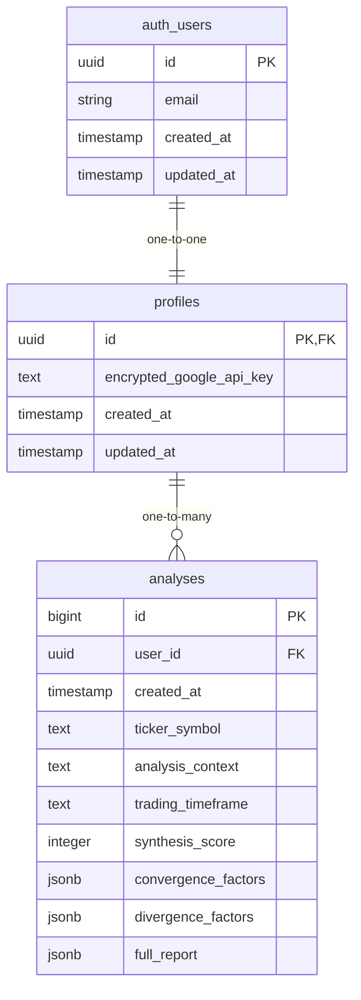

# Database Architecture Design Document

## Overview

This document outlines the PostgreSQL database schema design for Signal-360, implemented on Supabase. The design focuses on secure user profile management, encrypted API key storage, and comprehensive analysis result tracking. The schema leverages Supabase's built-in authentication system and extends it with custom tables for application-specific data.

## Architecture

### Database Platform
- **Platform**: Supabase (PostgreSQL-based)
- **Authentication**: Supabase Auth (auth.users table)
- **Encryption**: pgsodium extension for secure API key storage
- **Security**: Row Level Security (RLS) policies for data isolation

### Schema Overview
The database consists of two main custom tables that extend Supabase's authentication system:
1. `profiles` - User profile information and encrypted API keys
2. `analyses` - Historical analysis results and metadata

## Components and Interfaces

### Table Relationships



### Profiles Table

The `profiles` table extends user authentication with application-specific data:

```sql
CREATE TABLE profiles (
    id UUID PRIMARY KEY REFERENCES auth.users(id) ON DELETE CASCADE,
    encrypted_google_api_key TEXT,
    created_at TIMESTAMP WITH TIME ZONE DEFAULT NOW() NOT NULL,
    updated_at TIMESTAMP WITH TIME ZONE DEFAULT NOW() NOT NULL
);

-- Enable Row Level Security
ALTER TABLE profiles ENABLE ROW LEVEL SECURITY;

-- Create policy for users to access only their own profile
CREATE POLICY "Users can view own profile" ON profiles
    FOR SELECT USING (auth.uid() = id);

CREATE POLICY "Users can update own profile" ON profiles
    FOR UPDATE USING (auth.uid() = id);

CREATE POLICY "Users can insert own profile" ON profiles
    FOR INSERT WITH CHECK (auth.uid() = id);

-- Create updated_at trigger
CREATE OR REPLACE FUNCTION update_updated_at_column()
RETURNS TRIGGER AS $$
BEGIN
    NEW.updated_at = NOW();
    RETURN NEW;
END;
$$ language 'plpgsql';

CREATE TRIGGER update_profiles_updated_at
    BEFORE UPDATE ON profiles
    FOR EACH ROW
    EXECUTE FUNCTION update_updated_at_column();
```

### Analyses Table

The `analyses` table stores comprehensive analysis results:

```sql
CREATE TABLE analyses (
    id BIGSERIAL PRIMARY KEY,
    user_id UUID NOT NULL REFERENCES profiles(id) ON DELETE CASCADE,
    created_at TIMESTAMP WITH TIME ZONE DEFAULT NOW() NOT NULL,
    ticker_symbol TEXT NOT NULL,
    analysis_context TEXT NOT NULL CHECK (analysis_context IN ('investment', 'trading')),
    trading_timeframe TEXT,
    synthesis_score INTEGER CHECK (synthesis_score >= 0 AND synthesis_score <= 100),
    convergence_factors JSONB DEFAULT '[]'::jsonb,
    divergence_factors JSONB DEFAULT '[]'::jsonb,
    full_report JSONB DEFAULT '{}'::jsonb
);

-- Enable Row Level Security
ALTER TABLE analyses ENABLE ROW LEVEL SECURITY;

-- Create policy for users to access only their own analyses
CREATE POLICY "Users can view own analyses" ON analyses
    FOR SELECT USING (auth.uid() = user_id);

CREATE POLICY "Users can insert own analyses" ON analyses
    FOR INSERT WITH CHECK (auth.uid() = user_id);

-- Create indexes for common query patterns
CREATE INDEX idx_analyses_user_id ON analyses(user_id);
CREATE INDEX idx_analyses_ticker_symbol ON analyses(ticker_symbol);
CREATE INDEX idx_analyses_created_at ON analyses(created_at DESC);
CREATE INDEX idx_analyses_user_ticker ON analyses(user_id, ticker_symbol);
```

## Data Models

### Profile Model
```typescript
interface Profile {
  id: string; // UUID from auth.users
  encrypted_google_api_key: string | null;
  created_at: string;
  updated_at: string;
}
```

### Analysis Model
```typescript
interface Analysis {
  id: number;
  user_id: string;
  created_at: string;
  ticker_symbol: string;
  analysis_context: 'investment' | 'trading';
  trading_timeframe: string | null;
  synthesis_score: number; // 0-100
  convergence_factors: string[] | object[];
  divergence_factors: string[] | object[];
  full_report: object;
}
```

## Error Handling

### Database Constraints
- **Foreign Key Constraints**: Ensure referential integrity between tables
- **Check Constraints**: Validate analysis_context values and synthesis_score range
- **NOT NULL Constraints**: Enforce required fields

### Security Measures
- **Row Level Security**: Users can only access their own data
- **Cascade Deletes**: Maintain data consistency when users are deleted
- **Encrypted Storage**: API keys stored using pgsodium encryption

### Error Scenarios
1. **Invalid Analysis Context**: Check constraint prevents invalid values
2. **Invalid Synthesis Score**: Check constraint ensures 0-100 range
3. **Orphaned Records**: Foreign key constraints prevent orphaned data
4. **Unauthorized Access**: RLS policies block cross-user data access

## Testing Strategy

### Unit Tests
- Validate table creation and constraints
- Test foreign key relationships
- Verify check constraints work correctly
- Test RLS policies prevent unauthorized access

### Integration Tests
- Test profile creation on user registration
- Verify analysis insertion with proper user association
- Test cascade deletion behavior
- Validate encryption/decryption of API keys

### Security Tests
- Attempt cross-user data access (should fail)
- Test API key encryption in storage
- Verify RLS policy enforcement
- Test SQL injection prevention

### Performance Tests
- Query performance with indexes
- Bulk analysis insertion performance
- Complex JSONB queries on factors and reports
- Concurrent user access patterns

## Security Considerations

### API Key Encryption
The `encrypted_google_api_key` field uses PostgreSQL's pgsodium extension for encryption:

```sql
-- Example encryption/decryption (to be implemented in Edge Functions)
-- Encryption: pgsodium.crypto_secretbox(api_key, key_id)
-- Decryption: pgsodium.crypto_secretbox_open(encrypted_key, key_id)
```

### Row Level Security
All tables implement RLS to ensure users can only access their own data:
- Profiles: Users can only view/update their own profile
- Analyses: Users can only view/insert their own analyses

### Data Validation
- Analysis context restricted to 'investment' or 'trading'
- Synthesis score constrained to 0-100 range
- Required fields enforced with NOT NULL constraints

## Migration Strategy

### Initial Setup
1. Enable pgsodium extension in Supabase
2. Create profiles table with RLS policies
3. Create analyses table with indexes and RLS policies
4. Set up triggers for updated_at timestamps

### Future Considerations
- Additional analysis metadata fields
- Performance optimization indexes
- Data archival strategies for old analyses
- Enhanced security measures as needed