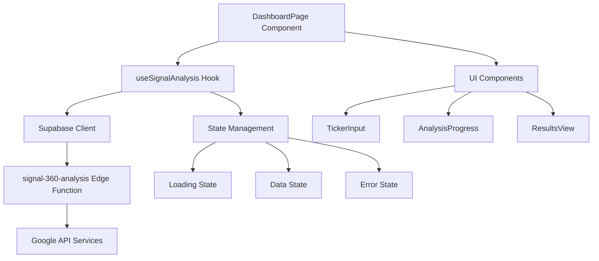
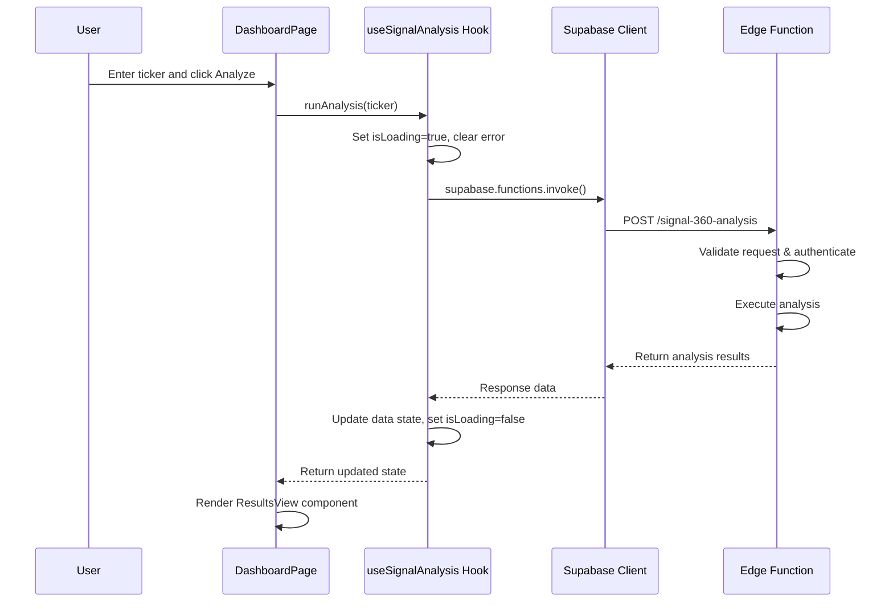

# Design Document

## Overview

The Frontend-Backend Connection feature establishes a robust integration between the React frontend and the Supabase Edge Function 'signal-360-analysis'. This design implements a custom React hook pattern that encapsulates API communication, state management, and error handling, providing a clean interface for triggering stock analysis from the dashboard.

## Architecture

### High-Level Architecture



### Component Integration Flow



## Components and Interfaces

### 1. useSignalAnalysis Custom Hook

**Location**: `src/hooks/useSignalAnalysis.ts`

**Interface**:
```typescript
interface UseSignalAnalysisReturn {
  data: AnalysisResponse | null;
  error: string | null;
  isLoading: boolean;
  runAnalysis: (ticker: string) => Promise<void>;
}

interface AnalysisResponse {
  success: boolean;
  message: string;
  timestamp: string;
  executionTime: number;
  ticker: string;
  context: string;
  data: {
    fundamental?: any;
    technical?: any;
    esg?: any;
  };
  partial?: boolean;
  failedAnalyses?: string[];
}
```

**Key Features**:
- State management for loading, data, and error states
- Async function to trigger analysis on demand
- Automatic state reset before new requests
- Comprehensive error handling with user-friendly messages
- Integration with existing Supabase client configuration

### 2. DashboardPage Integration

**Location**: `src/pages/DashboardPage.tsx`

**Integration Points**:
- Import and initialize the `useSignalAnalysis` hook
- Connect the `runAnalysis` function to the existing analyze button
- Replace mock analysis logic with real API calls
- Maintain existing UI flow and component structure
- Preserve current step-based navigation system

**State Management Changes**:
- Remove mock progress simulation logic
- Replace mock data generation with real API responses
- Integrate real loading states from the hook
- Handle real error states from API failures

### 3. Supabase Client Integration

**Location**: `src/lib/supabase.ts`

**Current Configuration**:
- Already properly configured with environment variables
- Includes authentication settings for session management
- Exports `supabase` client for use in hooks

**Edge Function Integration**:
- Uses `supabase.functions.invoke()` method
- Passes ticker in request body as expected by Edge Function
- Handles authentication automatically through existing session

## Data Models

### Request Format
```typescript
interface AnalysisRequest {
  ticker: string; // 1-5 character stock symbol, uppercase
}
```

### Response Format
```typescript
interface AnalysisResponse {
  success: boolean;
  message: string;
  timestamp: string;
  executionTime: number;
  ticker: string;
  context: string;
  data: {
    fundamental?: FundamentalData;
    technical?: TechnicalData;
    esg?: ESGData;
  };
  partial?: boolean; // True if some analyses failed
  failedAnalyses?: string[]; // List of failed analysis types
}
```

### Error Response Format
```typescript
interface ErrorResponse {
  success: false;
  error: {
    code: string;
    message: string;
    details?: ValidationError[];
  };
}
```

## Error Handling

### Error Categories and User Messages

1. **Authentication Errors**
   - Code: `MISSING_TOKEN`, `INVALID_TOKEN`
   - User Message: "Authentication failed. Please log in again."

2. **Validation Errors**
   - Code: `VALIDATION_ERROR`
   - User Message: "Invalid ticker symbol. Please enter a valid stock symbol (1-5 letters)."

3. **Configuration Errors**
   - Code: `API_KEY_NOT_CONFIGURED`
   - User Message: "Google API key not configured. Please add your API key in the profile section."

4. **Network/Server Errors**
   - Code: `INTERNAL_ERROR`, `DATABASE_ERROR`
   - User Message: "Analysis service temporarily unavailable. Please try again later."

5. **Partial Results**
   - When `partial: true` in response
   - User Message: "Analysis completed with some limitations. Some data sources were unavailable."

### Error Recovery Strategy

- Clear error state before new requests
- Provide retry capability for failed requests
- Maintain user context during error states
- Log errors for debugging while showing user-friendly messages

## Testing Strategy

### Unit Tests for useSignalAnalysis Hook

**Test File**: `src/hooks/__tests__/useSignalAnalysis.test.ts`

**Test Cases**:
1. **Initial State**: Hook returns correct initial state
2. **Loading State**: `isLoading` becomes true when `runAnalysis` is called
3. **Success State**: Data is updated and loading becomes false on success
4. **Error State**: Error message is set and loading becomes false on failure
5. **State Reset**: Previous state is cleared when new analysis starts
6. **Authentication Handling**: Proper error handling for auth failures
7. **Network Error Handling**: Graceful handling of network failures

### Integration Tests

**Test File**: `src/pages/__tests__/DashboardPage-integration.test.tsx`

**Test Cases**:
1. **End-to-End Flow**: Complete analysis flow from input to results
2. **Error Display**: Error messages are properly displayed in UI
3. **Loading States**: Loading components are shown during analysis
4. **Results Display**: Analysis results are properly rendered
5. **State Transitions**: Proper navigation between dashboard steps

### Mock Strategy

- Mock Supabase client for unit tests
- Mock Edge Function responses for integration tests
- Test both success and error scenarios
- Verify proper state management throughout the flow

## Performance Considerations

### Optimization Strategies

1. **Request Debouncing**: Prevent multiple simultaneous requests
2. **State Management**: Efficient state updates to minimize re-renders
3. **Error Boundaries**: Prevent crashes from API failures
4. **Loading States**: Immediate feedback for better user experience

### Monitoring

- Track API response times through Edge Function logs
- Monitor error rates and types
- Measure user engagement with analysis features
- Track conversion from analysis to goal selection

## Security Considerations

### Data Protection

- API keys are encrypted and stored securely in database
- JWT tokens are handled automatically by Supabase client
- No sensitive data is logged in frontend console
- CORS headers are properly configured in Edge Function

### Input Validation

- Ticker symbols are validated on both frontend and backend
- Request sanitization prevents injection attacks
- Authentication is required for all analysis requests
- Rate limiting is handled by Supabase infrastructure

## Migration Strategy

### Phased Implementation

1. **Phase 1**: Create and test the `useSignalAnalysis` hook in isolation
2. **Phase 2**: Integrate hook into DashboardPage while maintaining existing UI
3. **Phase 3**: Replace mock data with real API responses
4. **Phase 4**: Remove mock logic and finalize error handling

### Backward Compatibility

- Maintain existing component interfaces during transition
- Preserve current UI/UX patterns and user flows
- Ensure graceful degradation if API is unavailable
- Keep existing mock data as fallback during development