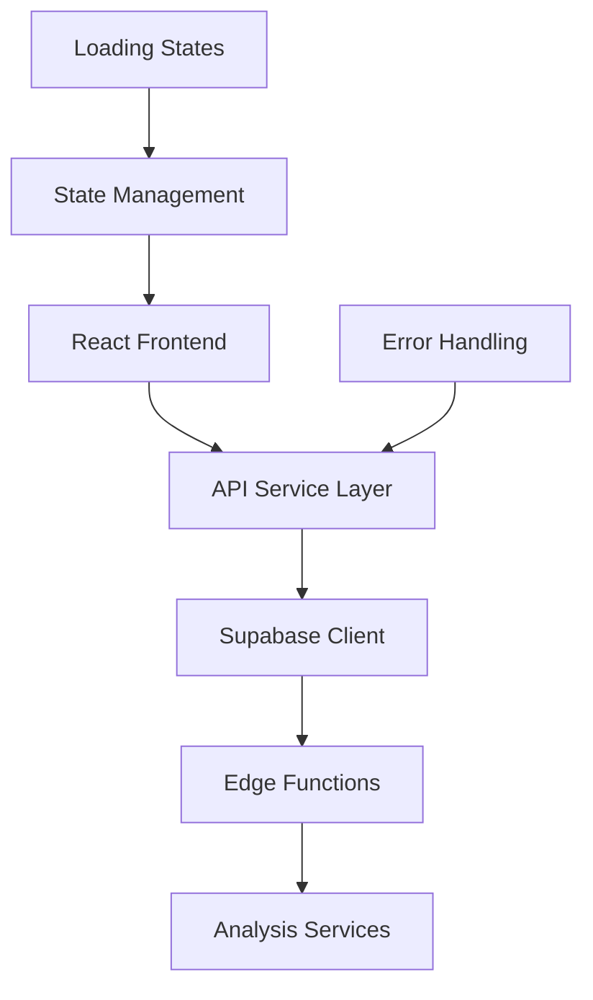
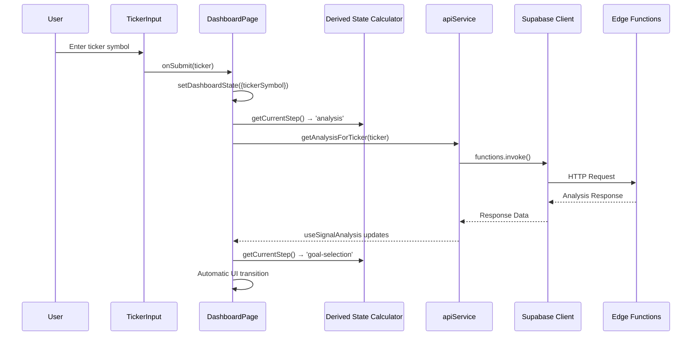
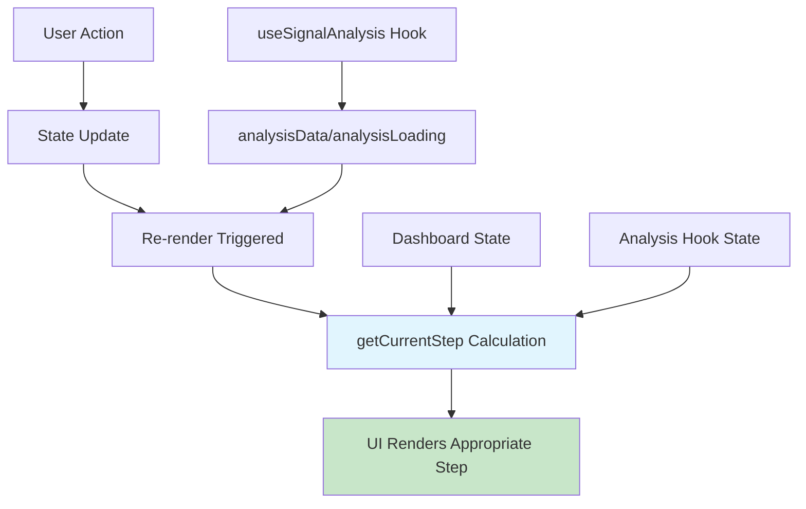

# Design Document

## Overview

The Frontend-Backend Integration feature establishes a robust connection between the React frontend and Supabase Edge Functions for Signal-360. The design leverages the existing architecture while creating a dedicated API service layer that centralizes backend communications. The integration uses the established technology stack including React with TypeScript, Supabase client, and axios for HTTP requests, ensuring consistency with project conventions.

Based on the codebase analysis, the Supabase client already exists at `src/lib/supabase.ts` and is properly configured with environment variables. The `useSignalAnalysis` hook provides the foundation for analysis operations, and the `DashboardPage` component manages the user flow. This design will enhance the existing structure by creating a centralized API service layer and improving error handling.

## Architecture

### High-Level Architecture



### Component Interaction Flow with Derived State



### Derived State Pattern Architecture

The new architecture eliminates imperative state synchronization in favor of declarative state calculation:



## Derived State Pattern Implementation

### Overview

The DashboardPage component has been refactored to use a "Derived State" pattern, which represents a significant architectural improvement over the previous imperative state synchronization approach.

### Previous Architecture Issues

The original implementation used a `useEffect` hook to imperatively synchronize the component's local `currentStep` state with changes from the `useSignalAnalysis` hook:

```typescript
// PROBLEMATIC PATTERN (removed):
useEffect(() => {
  if (dashboardState.currentStep === 'analysis' && analysisData && !analysisLoading) {
    setDashboardState(prev => ({ ...prev, currentStep: 'goal-selection' }));
  }
}, [analysisData, analysisLoading, dashboardState.currentStep]);
```

**Issues with the old pattern**:
- Race conditions between state updates
- Complex dependency arrays in useEffect
- Potential for infinite re-render loops
- Difficult to debug state synchronization issues
- Imperative rather than declarative logic

### New Derived State Architecture

The refactored implementation computes the current step declaratively on every render:

```typescript
// SUPERIOR PATTERN (current implementation):
const getCurrentStep = (): AnalysisStep => {
  const { tickerSymbol, results, goalSelection } = dashboardState;
  
  // Priority-based step determination
  if (!tickerSymbol) return 'input';           // Highest priority: no ticker
  if (results) return 'results';               // Results available
  if (goalSelection) return 'results';         // Goal selected
  if (analysisData) return 'goal-selection';   // Analysis complete
  if (analysisLoading) return 'analysis';      // Analysis in progress
  return 'input';                              // Safe fallback
};

const currentStep = getCurrentStep(); // Computed on every render
```

### Benefits of Derived State Pattern

1. **Eliminates Race Conditions**: No imperative state synchronization means no timing issues
2. **Predictable Behavior**: Step is always computed from current data state
3. **Simplified Logic**: Pure function calculation instead of complex useEffect dependencies
4. **Better Performance**: Reduces unnecessary re-renders and state updates
5. **Easier Testing**: Pure function can be tested in isolation
6. **Self-Correcting**: Always reflects the true state of available data
7. **Modern React Principles**: Aligns with React's declarative paradigm

### Implementation Details

**State Structure Changes**:
```typescript
// Before: currentStep was part of state
interface DashboardState {
  currentStep: AnalysisStep; // REMOVED
  tickerSymbol: string;
  // ... other properties
}

// After: currentStep is computed
interface DashboardState {
  // currentStep: REMOVED - computed declaratively
  tickerSymbol: string;
  results: AnalysisResult | null;
  goalSelection: string | null;
  // ... other properties
}
```

**Step Calculation Logic**:
The `getCurrentStep()` function uses a priority-based approach:
1. **No ticker symbol** → Always return to input (highest priority for reset scenarios)
2. **Results available** → Show results screen
3. **Goal selected** → Proceed to results
4. **Analysis data available** → Show goal selection
5. **Analysis loading** → Show analysis progress
6. **Fallback** → Return to input (safe default)

### Workflow Transitions

The new pattern enables seamless automatic transitions:

1. **User submits ticker** → `tickerSymbol` set → Step: 'analysis'
2. **Analysis starts** → `analysisLoading: true` → Step: 'analysis' (loading UI)
3. **Analysis completes** → `analysisData` available → Step: 'goal-selection' (automatic)
4. **User selects goal** → `goalSelection` set → Step: 'results' (automatic)
5. **User starts new analysis** → `tickerSymbol` cleared → Step: 'input' (automatic reset)

## Components and Interfaces

### 1. Supabase Client Configuration

**Location**: `src/lib/supabaseClient.ts` (rename from existing `src/lib/supabase.ts`)

The existing Supabase client will be enhanced to ensure proper configuration and error handling:

```typescript
interface SupabaseConfig {
  url: string;
  anonKey: string;
  options?: {
    auth: {
      autoRefreshToken: boolean;
      persistSession: boolean;
      detectSessionInUrl: boolean;
    };
  };
}
```

**Key Features**:
- Environment variable validation
- Proper error handling for missing configuration
- Consistent export naming convention
- Authentication configuration for session management

### 2. API Service Layer

**Location**: `src/lib/apiService.ts`

A new centralized service for all backend communications:

```typescript
interface AnalysisApiResponse {
  success: boolean;
  data?: AnalysisData;
  error?: ApiError;
  partial?: boolean;
  failedAnalyses?: string[];
}

interface ApiError {
  code: string;
  message: string;
  details?: string;
}

interface AnalysisData {
  ticker: string;
  timestamp: string;
  fundamental?: FundamentalAnalysis;
  technical?: TechnicalAnalysis;
  esg?: ESGAnalysis;
}
```

**Key Functions**:
- `getAnalysisForTicker(ticker: string): Promise<AnalysisApiResponse>`
- Error transformation and user-friendly messaging
- Request/response logging for debugging
- Timeout handling and retry logic

### 3. Enhanced State Management - Derived State Pattern

**Modern Declarative State Architecture**:

The DashboardPage component implements a superior "Derived State" pattern that eliminates race conditions and improves predictability by computing the current step declaratively on every render based on available data.

```typescript
// Derived State Pattern Implementation
const getCurrentStep = (): AnalysisStep => {
  const { tickerSymbol, results, goalSelection } = dashboardState;
  
  // Priority-based step determination
  if (!tickerSymbol) return 'input';           // No ticker = input screen
  if (results) return 'results';               // Results available = results screen
  if (goalSelection) return 'results';         // Goal selected = results screen
  if (analysisData) return 'goal-selection';   // Analysis complete = goal selection
  if (analysisLoading) return 'analysis';      // Analysis running = analysis screen
  return 'input';                              // Safe fallback
};

// Simplified State Interface (currentStep removed)
interface DashboardState {
  tickerSymbol: string;
  analysisId: string | null;
  analysisProgress: any | null;
  goalSelection: string | null;
  tradingTimeframe: string | null;
  results: AnalysisResult | null;
  error: DashboardError | null;
  loading: boolean;
  // currentStep: REMOVED - Now computed declaratively
}
```

**Key Benefits of Derived State Pattern**:
- **Eliminates Race Conditions**: No imperative state synchronization
- **Predictable Rendering**: Step is always computed from current data
- **Simplified Logic**: No complex useEffect dependencies
- **Better Performance**: Reduces unnecessary re-renders
- **Easier Testing**: Pure function for step calculation
- **Resilient Architecture**: Self-correcting based on available data

**Integration with `useSignalAnalysis` hook**:

```typescript
interface AnalysisState {
  data: AnalysisApiResponse | null;
  isLoading: boolean;
  error: string | null;
}

interface AnalysisActions {
  runAnalysis: (ticker: string) => Promise<void>;
}
```

### 4. Component Integration Points

**TickerInput Component** (existing - to be enhanced):
- Integration with new API service
- Enhanced error display
- Loading state management

**DashboardPage Component** (refactored with Derived State pattern):
- Declarative step calculation based on available data
- Simplified state management without imperative synchronization
- Enhanced error boundary integration
- Automatic workflow transitions without manual intervention
- Results display coordination

## Data Models

### Request/Response Models

```typescript
// API Request
interface AnalysisRequest {
  ticker: string;
  context?: 'investment' | 'trading';
}

// API Response
interface AnalysisResponse {
  success: boolean;
  message: string;
  timestamp: string;
  executionTime: number;
  ticker: string;
  context: string;
  data: {
    fundamental?: any;
    technical?: any;
    esg?: any;
  };
  partial?: boolean;
  failedAnalyses?: string[];
}

// Error Response
interface ErrorResponse {
  success: false;
  error: {
    code: string;
    message: string;
    details?: Array<{
      field: string;
      message: string;
      code: string;
    }>;
  };
}
```

### State Models

```typescript
// Component State
interface ComponentState {
  loading: boolean;
  data: AnalysisResponse | null;
  error: string | null;
}

// Dashboard State (refactored with Derived State pattern)
interface DashboardState {
  // currentStep: REMOVED - Now computed declaratively via getCurrentStep()
  tickerSymbol: string;
  analysisId: string | null;
  analysisProgress: any | null;
  goalSelection: string | null;
  tradingTimeframe: string | null;
  results: AnalysisResult | null;
  error: DashboardError | null;
  loading: boolean;
}

// Derived State Calculation
type AnalysisStep = 'input' | 'analysis' | 'goal-selection' | 'results';

const getCurrentStep = (
  dashboardState: DashboardState,
  analysisData: AnalysisApiResponse | null,
  analysisLoading: boolean
): AnalysisStep => {
  const { tickerSymbol, results, goalSelection } = dashboardState;
  
  if (!tickerSymbol) return 'input';
  if (results) return 'results';
  if (goalSelection) return 'results';
  if (analysisData) return 'goal-selection';
  if (analysisLoading) return 'analysis';
  return 'input';
};
```

## Error Handling

### Error Classification

1. **Network Errors**: Connection issues, timeouts
2. **Authentication Errors**: Invalid tokens, expired sessions
3. **Validation Errors**: Invalid ticker symbols, missing data
4. **Service Errors**: Backend service failures, API limits
5. **Unknown Errors**: Unexpected failures

### Error Handling Strategy

```typescript
interface ErrorHandler {
  transformError(error: any): UserFriendlyError;
  shouldRetry(error: ErrorType): boolean;
  getRetryDelay(attempt: number): number;
}

interface UserFriendlyError {
  message: string;
  recoverable: boolean;
  actionable: boolean;
  retryAfter?: number;
}
```

### Error Recovery Mechanisms

- Automatic retry for transient failures
- User-initiated retry for recoverable errors
- Graceful degradation for partial failures
- Clear error messaging with actionable guidance

## Testing Strategy

### Unit Testing

**API Service Tests**:
- Mock Supabase client responses
- Test error transformation logic
- Validate request/response handling
- Test timeout and retry mechanisms

**Component Integration Tests**:
- Mock API service calls
- Test derived state calculations with `getCurrentStep()`
- Validate automatic step transitions
- Test error display and recovery
- Test loading states and UI feedback
- Verify step priority logic

### Integration Testing

**End-to-End Flow Tests**:
- Complete analysis workflow with automatic transitions
- Error scenario handling and recovery
- Derived state behavior validation
- User interaction flows without manual intervention
- Step calculation accuracy under various conditions

**API Integration Tests**:
- Real Supabase Edge Function calls
- Authentication flow validation
- Response format verification
- Error response handling

### Testing Tools and Frameworks

- **Jest**: Unit testing framework
- **React Testing Library**: Component testing
- **MSW (Mock Service Worker)**: API mocking
- **Cypress**: End-to-end testing

### Test Coverage Requirements

- API Service: 90% code coverage
- Component Integration: 85% code coverage
- Error Handling: 95% code coverage
- Critical User Flows: 100% coverage
- **Derived State Logic**: 100% coverage (pure function testing)

### Derived State Testing Strategy

**Unit Tests for `getCurrentStep()` Function**:
```typescript
describe('getCurrentStep', () => {
  it('returns input when no ticker symbol', () => {
    const state = { tickerSymbol: '', results: null, goalSelection: null };
    expect(getCurrentStep(state, null, false)).toBe('input');
  });

  it('returns results when results available', () => {
    const state = { tickerSymbol: 'AAPL', results: mockResults, goalSelection: null };
    expect(getCurrentStep(state, mockAnalysisData, false)).toBe('results');
  });

  it('returns goal-selection when analysis complete', () => {
    const state = { tickerSymbol: 'AAPL', results: null, goalSelection: null };
    expect(getCurrentStep(state, mockAnalysisData, false)).toBe('goal-selection');
  });

  it('returns analysis when loading', () => {
    const state = { tickerSymbol: 'AAPL', results: null, goalSelection: null };
    expect(getCurrentStep(state, null, true)).toBe('analysis');
  });
});
```

**Integration Tests for Step Transitions**:
- Test automatic progression through workflow steps
- Verify priority-based step calculation
- Test reset scenarios (clearing ticker symbol)
- Validate error state handling

## Performance Considerations

### Optimization Strategies

1. **Request Optimization**:
   - Request deduplication
   - Caching for repeated requests
   - Compression for large responses

2. **State Management**:
   - Efficient re-rendering
   - Memory leak prevention
   - State cleanup on unmount

3. **Error Handling**:
   - Fast error detection
   - Minimal error processing overhead
   - Efficient retry mechanisms

### Monitoring and Metrics

- API response times
- Error rates by category
- User interaction patterns
- Performance bottlenecks

## Security Considerations

### Data Protection

- Environment variable security
- API key management
- Response data sanitization
- Error message sanitization (no sensitive data exposure)

### Authentication

- Token validation
- Session management
- Automatic token refresh
- Secure error handling for auth failures

## Implementation Phases

### Phase 1: Core Infrastructure
- Verify/enhance Supabase client configuration
- Create API service layer
- Implement basic error handling

### Phase 2: Component Integration
- Enhance TickerInput component
- Update DashboardPage state management
- Implement loading states

### Phase 3: Error Handling & UX
- Comprehensive error handling
- User-friendly error messages
- Retry mechanisms

### Phase 4: Testing & Validation
- Unit test coverage
- Integration testing
- End-to-end validation

## Migration Strategy

### Architectural Refactoring Completed

The design has been successfully implemented with significant architectural improvements:

**Major Changes**:
- `src/lib/supabase.ts` → Enhanced as `src/lib/supabaseClient.ts`
- `src/hooks/useSignalAnalysis.ts` → Enhanced with new API service
- `src/components/TickerInput.tsx` → Integration with new error handling
- `src/pages/DashboardPage.tsx` → **Completely refactored with Derived State pattern**

**DashboardPage Refactoring**:
- **Removed**: Imperative `useEffect` state synchronization
- **Removed**: `currentStep` from component state
- **Added**: Declarative `getCurrentStep()` function
- **Added**: Priority-based step calculation logic
- **Improved**: Automatic workflow transitions
- **Enhanced**: Error handling and recovery mechanisms

### Benefits Achieved

1. **Eliminated Race Conditions**: No more timing issues between state updates
2. **Improved Reliability**: Predictable, deterministic behavior
3. **Better Performance**: Reduced unnecessary re-renders
4. **Enhanced Maintainability**: Simpler, more testable code
5. **Modern Architecture**: Aligned with React best practices
6. **Seamless UX**: Automatic transitions without manual intervention

### Backward Compatibility

- **User Experience**: Preserved and improved (smoother transitions)
- **Component Interfaces**: Enhanced without breaking existing contracts
- **Error Handling**: Improved with better recovery mechanisms
- **Performance**: Enhanced through architectural improvements

### Testing Implications

The new Derived State pattern improves testability:
- `getCurrentStep()` is a pure function that can be tested in isolation
- No complex useEffect dependencies to mock
- Predictable state transitions for integration testing
- Simplified component testing with deterministic behavior