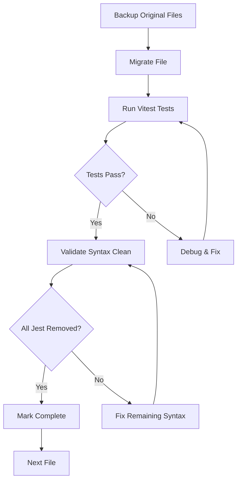

# Design Document

## Overview

The Migration Remediation - Phase 2 design addresses the systematic migration of 11 remaining Jest test files to Vitest syntax. This design ensures complete elimination of 120 Jest syntax patterns from the codebase while maintaining test functionality and coverage. The approach follows a file-by-file migration strategy with comprehensive validation at each step, handling complex scenarios including timer mocking, dynamic imports, and React-specific testing patterns.

## Architecture

### Migration Pipeline Architecture

```
Input Files (11 Jest Files) → Syntax Analysis → Migration Transform → Validation → Output (Vitest Files)
```

The migration follows a structured pipeline:
1. **File Analysis**: Parse each file to identify Jest-specific syntax patterns
2. **Syntax Transformation**: Convert Jest syntax to Vitest equivalents
3. **Functional Validation**: Ensure tests maintain their original behavior
4. **Integration Testing**: Verify tests work within the Vitest ecosystem

### Target Files for Migration

Based on the comprehensive validation scan, the following 11 files require migration:

1. **Core Application Tests**:
   - `src/__tests__/validate-requirements.test.tsx` - 14 Jest patterns
   - `src/__tests__/error-handling-integration.test.tsx` - 13 Jest patterns
   - `src/__tests__/authentication-performance.test.tsx` - 15 Jest patterns
   - `src/__tests__/authentication-security.test.tsx` - 13 Jest patterns
   - `src/__tests__/routing-integration.test.tsx` - 9 Jest patterns

2. **Component Tests**:
   - `src/components/__tests__/protected-route-integration.test.tsx` - 7 Jest patterns
   - `src/components/__tests__/error-boundary.test.tsx` - 5 Jest patterns

3. **Context Tests**:
   - `src/contexts/__tests__/auth-context.test.tsx` - 10 Jest patterns

4. **Utility Tests**:
   - `src/utils/__tests__/session-manager.test.ts` - 12 Jest patterns
   - `src/utils/__tests__/jest-migration-validator.test.ts` - 20 Jest patterns
   - `src/utils/__tests__/migration-validation.test.ts` - 3 Jest patterns

**Total**: 120 Jest patterns across 11 files

## Components and Interfaces

### Migration Transform Component

The migration process handles the following Jest to Vitest transformations:

#### Import Transformations
```typescript
// Jest → Vitest
import { jest } from '@jest/globals' → import { vi } from 'vitest'
```

#### Mock Transformations
```typescript
// Jest → Vitest
jest.mock() → vi.mock()
jest.fn() → vi.fn()
jest.spyOn() → vi.spyOn()
jest.doMock() → vi.doMock()
jest.unmock() → vi.unmock()
```

#### Timer Transformations
```typescript
// Jest → Vitest
jest.useFakeTimers() → vi.useFakeTimers()
jest.clearAllTimers() → vi.clearAllTimers()
```

#### Cleanup Transformations
```typescript
// Jest → Vitest
jest.clearAllMocks() → vi.clearAllMocks()
jest.restoreAllMocks() → vi.restoreAllMocks()
```

### Validation Component

The validation system ensures migration completeness through:

1. **Syntax Scanner**: Regex-based detection of remaining Jest patterns
2. **Test Runner**: Execution of migrated tests with Vitest
3. **Coverage Validator**: Ensures test coverage is maintained
4. **Report Generator**: Creates migration completion documentation

## Data Models

### Migration Status Model
```typescript
interface MigrationStatus {
  fileName: string;
  originalJestPatterns: string[];
  migratedPatterns: string[];
  testsPassing: boolean;
  migrationComplete: boolean;
}
```

### Validation Result Model
```typescript
interface ValidationResult {
  totalFilesScanned: number;
  jestPatternsFound: number;
  failedFiles: string[];
  migrationComplete: boolean;
  detailedReport: string;
}
```

## Error Handling

### Migration Error Scenarios

1. **Syntax Conversion Errors**:
   - **Issue**: Complex Jest patterns that don't have direct Vitest equivalents
   - **Solution**: Manual conversion with custom implementations
   - **Fallback**: Document edge cases for manual review

2. **Test Execution Failures**:
   - **Issue**: Migrated tests fail to execute
   - **Solution**: Incremental debugging and syntax adjustment
   - **Rollback**: Maintain backup of original files

3. **Mock Compatibility Issues**:
   - **Issue**: Jest mocks behave differently in Vitest
   - **Solution**: Adjust mock implementations to match Vitest patterns
   - **Validation**: Compare test outputs before and after migration

### Error Recovery Strategy

```typescript
interface ErrorRecovery {
  backupOriginalFile(): void;
  validateMigration(): ValidationResult;
  rollbackOnFailure(): void;
  reportIssues(): string[];
}
```

## Testing Strategy

### Migration Testing Approach

1. **Pre-Migration Baseline**:
   - Execute all Jest tests to establish baseline behavior
   - Document test outputs and coverage metrics
   - Create file backups for rollback capability

2. **Post-Migration Validation**:
   - Execute migrated tests with Vitest
   - Compare outputs with baseline results
   - Verify test coverage is maintained

3. **Integration Testing**:
   - Run full test suite to ensure no regressions
   - Validate CI/CD pipeline compatibility
   - Test build process with migrated files

### Test Execution Workflow



## Implementation Phases

### Phase 1: File-by-File Migration
- Migrate each of the 11 identified files individually
- Handle 120 total Jest patterns across all files
- Validate each file after migration
- Ensure tests pass before proceeding to next file
- Address complex patterns including timer mocking and dynamic imports

### Phase 2: Comprehensive Validation
- Run complete syntax scan across entire codebase
- Verify zero Jest patterns remain from the original 120
- Execute full test suite with Vitest
- Generate final migration completion report

### Phase 3: Documentation and Cleanup
- Update migration status documentation
- Remove any Jest-related dependencies if no longer needed
- Create lessons learned documentation for handling complex migration scenarios

## Performance Considerations

### Migration Efficiency
- Process files in order of complexity (simple to complex)
- Use automated regex replacements where possible
- Manual review for complex patterns

### Test Execution Performance
- Vitest typically performs better than Jest
- Parallel test execution should improve overall test suite speed
- Watch mode functionality will be enhanced

## Security Considerations

### Code Integrity
- Maintain test functionality during migration
- Preserve security-related test assertions
- Ensure mock implementations don't introduce vulnerabilities

### Dependency Management
- Remove Jest dependencies once migration is complete
- Ensure Vitest dependencies are properly configured
- Validate no security vulnerabilities in new dependencies