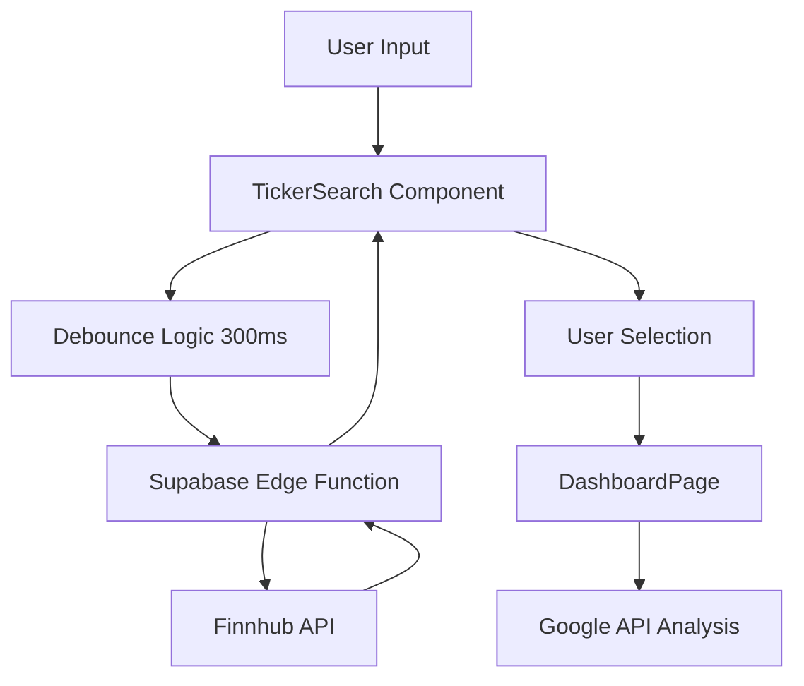

# Design Document

## Overview

The Predictive Ticker Search System implements a sophisticated autocomplete search feature for stock tickers using a hybrid API architecture. The system combines the Finnhub API for real-time ticker suggestions with the existing Google API analysis pipeline, providing users with a seamless, error-preventing search experience.

The design follows a secure proxy pattern where sensitive API keys are protected on the backend, while the frontend provides a responsive, accessible user interface with intelligent debouncing and keyboard navigation.

## Architecture

### High-Level Architecture



### Component Architecture

The system consists of three main architectural layers:

1. **Frontend Layer**: React component with TypeScript for type safety
2. **Proxy Layer**: Supabase Edge Function for secure API key management
3. **External API Layer**: Finnhub API for ticker search data

### Security Architecture

- **API Key Protection**: Finnhub API key stored in Supabase secrets, never exposed to frontend
- **Environment Separation**: Different key management for development (.env.local) and production (Supabase secrets)
- **Request Validation**: Input sanitization and validation at both frontend and backend layers

## Components and Interfaces

### Frontend Components

#### TickerSearch Component (`src/components/search/TickerSearch.tsx`)

**Purpose**: Reusable React component providing predictive ticker search functionality

**Props Interface**:
```typescript
interface TickerSearchProps {
  onTickerSelect: (ticker: string, companyName: string) => void;
  placeholder?: string;
  disabled?: boolean;
  autoFocus?: boolean;
  className?: string;
}
```

**State Interface**:
```typescript
interface TickerSearchState {
  query: string;
  suggestions: TickerSuggestion[];
  isLoading: boolean;
  isOpen: boolean;
  selectedIndex: number;
  error: string | null;
}
```

**Key Features**:
- Debounced input handling (300ms delay)
- Keyboard navigation (Arrow keys, Enter, Escape)
- Loading states and error handling
- Accessibility compliance (ARIA attributes)
- Responsive design with Tailwind CSS

#### Integration with DashboardPage

**Current Integration Point**: Replace existing `TickerInput` component in `DashboardPage.tsx`

**Integration Pattern**:
```typescript
// In DashboardPage.tsx
const handleTickerSelection = useCallback((ticker: string, companyName: string) => {
  // Trigger existing analysis flow
  handleTickerSubmit(ticker);
}, [handleTickerSubmit]);

// Replace TickerInput with TickerSearch
<TickerSearch
  onTickerSelect={handleTickerSelection}
  disabled={analysisLoading}
  autoFocus={currentStep === 'input'}
/>
```

### Backend Components

#### Supabase Edge Function (`supabase/functions/ticker-search/index.ts`)

**Purpose**: Secure proxy to Finnhub API for ticker search

**Request Interface**:
```typescript
interface TickerSearchRequest {
  query: string;
}
```

**Response Interface**:
```typescript
interface TickerSearchResponse {
  success: boolean;
  data?: TickerSuggestion[];
  error?: {
    code: string;
    message: string;
  };
}

interface TickerSuggestion {
  ticker: string;
  name: string;
  exchange?: string;
  type?: string;
}
```

**Security Features**:
- Environment variable validation
- Input sanitization
- Rate limiting considerations
- Error handling without exposing internal details

### API Integration

#### Finnhub API Integration

**Endpoint**: `https://finnhub.io/api/v1/search`
**Method**: GET
**Parameters**:
- `q`: Search query (ticker or company name)
- `token`: API key (from environment)

**Response Transformation**:
```typescript
// Finnhub response format
interface FinnhubSearchResult {
  count: number;
  result: Array<{
    description: string;
    displaySymbol: string;
    symbol: string;
    type: string;
  }>;
}

// Transform to our format
const transformFinnhubResponse = (data: FinnhubSearchResult): TickerSuggestion[] => {
  return data.result.slice(0, 10).map(item => ({
    ticker: item.symbol,
    name: item.description,
    exchange: item.displaySymbol !== item.symbol ? 'Multiple' : 'US',
    type: item.type
  }));
};
```

## Data Models

### TickerSuggestion Model

```typescript
interface TickerSuggestion {
  ticker: string;        // Stock symbol (e.g., "AAPL")
  name: string;          // Company name (e.g., "Apple Inc.")
  exchange?: string;     // Exchange name (e.g., "NASDAQ")
  type?: string;         // Security type (e.g., "Common Stock")
}
```

### Search State Model

```typescript
interface SearchState {
  query: string;
  suggestions: TickerSuggestion[];
  isLoading: boolean;
  isOpen: boolean;
  selectedIndex: number;
  error: string | null;
  debounceTimeout: NodeJS.Timeout | null;
}
```

## Error Handling

### Frontend Error Handling

**Error Categories**:
1. **Network Errors**: Connection issues, timeouts
2. **API Errors**: Invalid responses, rate limits
3. **Validation Errors**: Invalid input format
4. **User Errors**: No results found

**Error Display Strategy**:
- Inline error messages below search input
- Non-blocking error states (search remains functional)
- Retry mechanisms for transient errors
- Graceful degradation when API is unavailable

**Error Recovery**:
```typescript
const handleSearchError = (error: Error) => {
  if (error.name === 'AbortError') {
    // Request was cancelled, ignore
    return;
  }
  
  if (error.message.includes('rate limit')) {
    setError('Search temporarily unavailable. Please try again in a moment.');
    return;
  }
  
  setError('Unable to load suggestions. You can still enter a ticker manually.');
};
```

### Backend Error Handling

**Error Response Format**:
```typescript
interface ErrorResponse {
  success: false;
  error: {
    code: 'INVALID_INPUT' | 'API_ERROR' | 'RATE_LIMIT' | 'INTERNAL_ERROR';
    message: string;
  };
}
```

**Error Scenarios**:
1. **Missing API Key**: Return configuration error
2. **Invalid Query**: Return validation error
3. **Finnhub API Error**: Return generic API error
4. **Rate Limiting**: Return rate limit error with retry guidance

## Testing Strategy

### Frontend Testing

**Unit Tests** (`src/components/search/__tests__/TickerSearch.test.tsx`):
- Component rendering with different props
- Input handling and debouncing
- Keyboard navigation
- Error state handling
- Accessibility compliance

**Integration Tests**:
- Integration with DashboardPage
- API call mocking and error scenarios
- User interaction flows

**Test Scenarios**:
```typescript
describe('TickerSearch Component', () => {
  it('should debounce input changes', async () => {
    // Test debouncing logic
  });
  
  it('should handle keyboard navigation', () => {
    // Test arrow keys, enter, escape
  });
  
  it('should display error states gracefully', () => {
    // Test error handling
  });
  
  it('should be accessible', () => {
    // Test ARIA attributes and screen reader compatibility
  });
});
```

### Backend Testing

**Unit Tests** (`supabase/functions/ticker-search/__tests__/ticker-search.test.ts`):
- Request validation
- API key handling
- Response transformation
- Error scenarios

**Integration Tests**:
- End-to-end API flow
- Error handling with real API responses
- Performance under load

### End-to-End Testing

**User Journey Tests**:
1. User types ticker → sees suggestions → selects ticker → analysis starts
2. User types invalid input → sees appropriate error → can still proceed
3. API is down → user sees error → can enter ticker manually

## Performance Considerations

### Frontend Performance

**Debouncing Strategy**:
- 300ms delay to balance responsiveness and API efficiency
- Cancel previous requests when new ones are made
- Implement request deduplication

**Caching Strategy**:
```typescript
const searchCache = new Map<string, TickerSuggestion[]>();
const CACHE_TTL = 5 * 60 * 1000; // 5 minutes

const getCachedResults = (query: string): TickerSuggestion[] | null => {
  const cached = searchCache.get(query);
  if (cached && Date.now() - cached.timestamp < CACHE_TTL) {
    return cached.results;
  }
  return null;
};
```

**Rendering Optimization**:
- Use React.memo for suggestion list items
- Virtualization for large result sets (if needed)
- Minimize re-renders with useCallback and useMemo

### Backend Performance

**Response Optimization**:
- Limit results to 10 suggestions maximum
- Implement response compression
- Add appropriate cache headers

**Rate Limiting**:
- Implement client-side rate limiting
- Handle Finnhub API rate limits gracefully
- Consider implementing server-side caching

## Security Considerations

### API Key Security

**Development Environment**:
- Store Finnhub API key in `.env.local`
- Ensure `.env.local` is in `.gitignore`
- Use VITE_ prefix for frontend variables (none needed for this feature)

**Production Environment**:
- Store Finnhub API key in Supabase project secrets
- Access via `Deno.env.get('FINNHUB_API_KEY')`
- Never expose API keys to frontend

### Input Validation

**Frontend Validation**:
```typescript
const validateSearchQuery = (query: string): boolean => {
  // Minimum length check
  if (query.length < 1) return false;
  
  // Maximum length check
  if (query.length > 10) return false;
  
  // Character validation (alphanumeric and basic symbols)
  const validPattern = /^[a-zA-Z0-9\s\-\.]+$/;
  return validPattern.test(query);
};
```

**Backend Validation**:
```typescript
const sanitizeQuery = (query: string): string => {
  return query
    .trim()
    .slice(0, 10) // Limit length
    .replace(/[^a-zA-Z0-9\s\-\.]/g, ''); // Remove invalid characters
};
```

### CORS and Request Security

**CORS Configuration**:
- Allow requests from application domain
- Implement proper preflight handling
- Validate request origins in production

**Request Validation**:
- Validate request method (POST only)
- Validate content type (application/json)
- Implement request size limits

## Accessibility Features

### Keyboard Navigation

**Supported Keys**:
- `Arrow Down`: Move to next suggestion
- `Arrow Up`: Move to previous suggestion
- `Enter`: Select highlighted suggestion
- `Escape`: Close suggestions dropdown
- `Tab`: Move focus away from component

### Screen Reader Support

**ARIA Attributes**:
```typescript
<input
  role="combobox"
  aria-expanded={isOpen}
  aria-haspopup="listbox"
  aria-owns="suggestions-list"
  aria-activedescendant={selectedIndex >= 0 ? `suggestion-${selectedIndex}` : undefined}
  aria-describedby="search-instructions"
/>

<ul
  id="suggestions-list"
  role="listbox"
  aria-label="Ticker suggestions"
>
  {suggestions.map((suggestion, index) => (
    <li
      key={suggestion.ticker}
      id={`suggestion-${index}`}
      role="option"
      aria-selected={index === selectedIndex}
    >
      {suggestion.ticker} - {suggestion.name}
    </li>
  ))}
</ul>
```

### Visual Accessibility

**Design Requirements**:
- High contrast colors for suggestions
- Clear focus indicators
- Loading states with appropriate ARIA labels
- Error messages with proper semantic markup

## Responsive Design

### Breakpoint Strategy

**Mobile (< 768px)**:
- Full-width search input
- Larger touch targets for suggestions
- Simplified suggestion display

**Tablet (768px - 1024px)**:
- Optimized suggestion dropdown width
- Balanced information density

**Desktop (> 1024px)**:
- Full feature set
- Hover states for suggestions
- Keyboard shortcuts display

### Tailwind CSS Classes

**Base Styles**:
```css
.ticker-search-container {
  @apply relative w-full max-w-md mx-auto;
}

.ticker-search-input {
  @apply w-full px-4 py-3 text-lg border-2 border-gray-300 rounded-lg;
  @apply focus:border-blue-500 focus:ring-2 focus:ring-blue-200;
  @apply disabled:bg-gray-100 disabled:cursor-not-allowed;
}

.ticker-suggestions {
  @apply absolute top-full left-0 right-0 z-50 mt-1;
  @apply bg-white border border-gray-200 rounded-lg shadow-lg;
  @apply max-h-60 overflow-y-auto;
}

.ticker-suggestion {
  @apply px-4 py-3 cursor-pointer border-b border-gray-100 last:border-b-0;
  @apply hover:bg-blue-50 focus:bg-blue-50;
  @apply flex justify-between items-center;
}

.ticker-suggestion-selected {
  @apply bg-blue-100;
}
```

## Integration Points

### DashboardPage Integration

**Replacement Strategy**:
1. Import new TickerSearch component
2. Replace TickerInput component usage
3. Update callback handling for ticker selection
4. Maintain existing error handling patterns

**State Management**:
- No changes to existing dashboard state
- TickerSearch component manages its own internal state
- Selection triggers existing analysis flow

### Existing API Integration

**Compatibility**:
- New search system is completely separate from analysis APIs
- Selected ticker feeds into existing Google API analysis flow
- No changes required to existing analysis functions

**Error Handling Integration**:
- Search errors are handled independently
- Analysis errors continue to use existing error handling
- Clear separation of concerns between search and analysis

## Deployment Considerations

### Environment Setup

**Development Setup**:
1. Add `FINNHUB_API_KEY` to `.env.local`
2. Ensure `.env.local` is in `.gitignore`
3. Test with development Finnhub API key

**Production Setup**:
1. Add `FINNHUB_API_KEY` to Supabase project secrets
2. Deploy Edge Function to Supabase
3. Test with production API key

### Monitoring and Logging

**Frontend Logging**:
- Search performance metrics
- Error rates and types
- User interaction patterns

**Backend Logging**:
- API response times
- Error rates from Finnhub API
- Rate limiting incidents

### Rollback Strategy

**Gradual Rollout**:
1. Deploy backend function first
2. Test backend function independently
3. Deploy frontend changes with feature flag
4. Monitor performance and error rates
5. Full rollout after validation

**Rollback Plan**:
- Keep existing TickerInput component as backup
- Feature flag to switch between old and new components
- Database rollback not required (no schema changes)