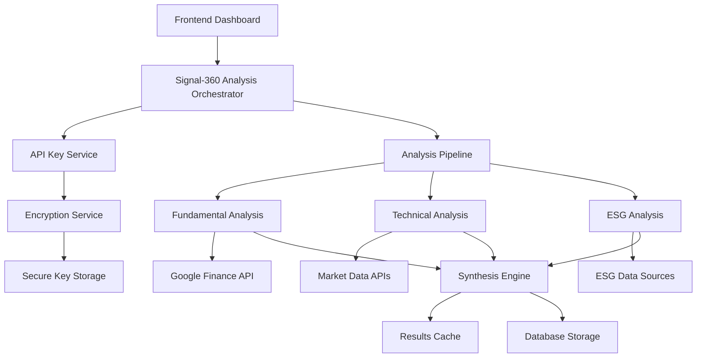

# Design Document

## Overview

The Real-Time Financial Analysis feature transforms Signal-360 from a prototype with simulated data into a production-ready SaaS platform. This system integrates with Google APIs to provide comprehensive, real-time financial analysis across three dimensions: Fundamental, Technical, and ESG analysis. The architecture leverages the existing Supabase Edge Functions infrastructure while implementing robust error handling, caching, and security measures.

## Architecture

### High-Level Architecture



### Request Flow

1. **User Interaction**: User selects ticker from search results
2. **Authentication**: Validate user session and permissions
3. **API Key Retrieval**: Securely decrypt user's Google API key
4. **Cache Check**: Check for existing fresh analysis results
5. **Parallel Analysis**: Execute Fundamental, Technical, and ESG analysis concurrently
6. **Synthesis**: Combine results using weighted scoring algorithm
7. **Response Formatting**: Structure results according to dashboard requirements
8. **Caching**: Store results for future requests
9. **Response Delivery**: Return comprehensive analysis to frontend

## Components and Interfaces

### 1. Analysis Orchestrator Service

**Purpose**: Central coordinator for the entire analysis pipeline

**Key Responsibilities**:
- Manage analysis workflow and error handling
- Coordinate parallel execution of analysis functions
- Handle partial failures gracefully
- Implement request deduplication and rate limiting

**Interface**:
```typescript
interface AnalysisOrchestrator {
  executeAnalysis(request: AnalysisRequest): Promise<AnalysisResponse>
  validateApiKey(userId: string): Promise<string>
  executeParallelAnalysis(ticker: string, context: string, apiKey: string): Promise<AnalysisResults>
}

interface AnalysisRequest {
  ticker: string
  context: 'investment' | 'trading'
  userId: string
  requestId: string
}

interface AnalysisResponse {
  synthesis_score: number
  recommendation: 'BUY' | 'SELL' | 'HOLD'
  confidence: number
  convergence_factors: string[]
  divergence_factors: string[]
  trade_parameters: TradeParameters
  key_ecos: EcoFactor[]
  full_report: AnalysisReport
  metadata: ResponseMetadata
}
```

### 2. Enhanced API Key Management

**Purpose**: Secure handling of user API keys with encryption and validation

**Key Features**:
- AES-256-GCM encryption for API keys at rest
- In-memory decryption with automatic cleanup
- API key validation and format checking
- Usage tracking and quota monitoring
- Rate limiting per user/key

**Interface**:
```typescript
interface ApiKeyService {
  getDecryptedApiKey(userId: string, keyType: string): Promise<DecryptedApiKey>
  validateApiKey(apiKey: string): ApiKeyValidation
  testApiKey(apiKey: string, keyType: string): Promise<boolean>
  updateUsageStats(userId: string, keyType: string): Promise<void>
}

interface DecryptedApiKey {
  api_key: string
  key_type: string
  user_id: string
  expires_at?: string
}
```

### 3. Google API Integration Service

**Purpose**: Standardized interface for Google API interactions

**Key Features**:
- Multiple API endpoint support (Custom Search, Finance, etc.)
- Automatic retry with exponential backoff
- Rate limit handling and queue management
- Response caching and validation
- Fallback to alternative data sources

**Interface**:
```typescript
interface GoogleApiClient {
  performAnalysis(ticker: string): Promise<AnalysisData>
  getFundamentalData(ticker: string): Promise<FundamentalData>
  getTechnicalData(ticker: string): Promise<TechnicalData>
  getESGData(ticker: string): Promise<ESGData>
}

interface GoogleApiConfig {
  apiKey: string
  baseUrl: string
  timeout: number
  retryConfig: RetryConfig
}
```

### 4. Analysis Pipeline Components

#### Fundamental Analysis Engine
- **Data Sources**: Google Finance API, Alpha Vantage (fallback), Financial Modeling Prep (fallback)
- **Metrics Calculated**: Financial ratios, growth metrics, valuation indicators, quality scores
- **Output**: Scored analysis with confidence levels and supporting factors

#### Technical Analysis Engine  
- **Data Sources**: Real-time price data, volume data, market indicators
- **Indicators**: Moving averages, RSI, MACD, Bollinger Bands, support/resistance levels
- **Context Awareness**: Different timeframes for investment vs trading analysis

#### ESG Analysis Engine
- **Data Sources**: ESG rating services, news sentiment, sustainability metrics
- **Metrics**: Environmental score, social score, governance score, controversy analysis
- **Integration**: Combines quantitative ESG data with qualitative news sentiment

### 5. Synthesis Engine

**Purpose**: Intelligent combination of analysis results with context-aware weighting

**Key Features**:
- Dynamic weighting based on analysis context (investment vs trading)
- Confidence-based weight adjustments
- Cross-analysis pattern recognition
- Convergence and divergence factor identification
- Trade parameter calculation

**Weighting Algorithm**:
```typescript
interface SynthesisWeights {
  investment: {
    fundamental: 0.5,  // 50% weight for long-term decisions
    technical: 0.3,    // 30% weight for timing
    esg: 0.2          // 20% weight for sustainability
  },
  trading: {
    fundamental: 0.2,  // 20% weight for context
    technical: 0.7,    // 70% weight for timing signals
    esg: 0.1          // 10% weight for sentiment
  }
}
```

### 6. Caching Layer

**Purpose**: Optimize performance and reduce API costs

**Cache Strategy**:
- **Analysis Results**: 4-hour TTL for complete analysis
- **Individual Components**: 2-hour TTL for fundamental data, 30-minute TTL for technical data
- **API Keys**: 1-hour TTL for decrypted keys (memory only)
- **Market Data**: 15-minute TTL for real-time data

**Cache Keys**:
```typescript
interface CacheKeys {
  analysis: `analysis:${ticker}:${context}:${timeframe}`
  fundamental: `fundamental:${ticker}`
  technical: `technical:${ticker}:${timeframe}`
  esg: `esg:${ticker}`
  apiKey: `apikey:${userId}:${keyType}`
}
```

## Data Models

### Analysis Result Models

```typescript
interface FundamentalAnalysisResult {
  score: number                    // 0-100
  factors: AnalysisFactor[]
  details: {
    financial_ratios: Record<string, number>
    growth_metrics: Record<string, number>
    valuation_metrics: Record<string, number>
    quality_indicators: Record<string, number>
  }
  confidence: number               // 0-1
  data_sources: string[]
}

interface TechnicalAnalysisResult {
  score: number                    // 0-100
  factors: AnalysisFactor[]
  details: {
    trend_indicators: Record<string, number>
    momentum_indicators: Record<string, number>
    volume_indicators: Record<string, number>
    support_resistance: SupportResistance
  }
  confidence: number               // 0-1
  timeframe_used: string
}

interface ESGAnalysisResult {
  score: number                    // 0-100
  factors: AnalysisFactor[]
  details: {
    environmental_score: number
    social_score: number
    governance_score: number
    sustainability_metrics: Record<string, any>
  }
  confidence: number               // 0-1
  key_ecos: EcoFactor[]
}
```

### Trade Parameters Model

```typescript
interface TradeParameters {
  entry_price: number
  stop_loss: number
  take_profit_levels: number[]
  risk_reward_ratio: number
  position_size_recommendation: number
  confidence: number
  methodology: string
  metadata: {
    calculation_timestamp: string
    volatility_used: number
    support_resistance_levels: {
      support: number[]
      resistance: number[]
    }
    risk_metrics: {
      max_drawdown_risk: number
      expected_return: number
      sharpe_estimate: number
    }
  }
}
```

## Error Handling

### Error Classification

1. **Authentication Errors**
   - Invalid or expired user session
   - Missing API key configuration
   - API key validation failures

2. **API Integration Errors**
   - Google API rate limits exceeded
   - Network connectivity issues
   - Invalid API responses
   - Service unavailability

3. **Data Processing Errors**
   - Insufficient data for analysis
   - Invalid ticker symbols
   - Calculation failures
   - Synthesis errors

4. **System Errors**
   - Database connectivity issues
   - Cache failures
   - Memory/resource constraints
   - Timeout errors

### Error Handling Strategy

```typescript
interface ErrorHandlingStrategy {
  retryPolicy: {
    maxAttempts: 3
    baseDelay: 1000
    maxDelay: 10000
    backoffMultiplier: 2
    jitter: true
  }
  
  fallbackStrategy: {
    useAlternativeDataSources: true
    allowPartialAnalysis: true
    provideMockDataWhenNecessary: false
    gracefulDegradation: true
  }
  
  userCommunication: {
    provideSpecificErrorMessages: true
    suggestResolutionSteps: true
    showRetryOptions: true
    indicatePartialResults: true
  }
}
```

### Graceful Degradation

- **Partial Analysis**: Continue with available data if one analysis type fails
- **Alternative Data Sources**: Fallback to secondary APIs when primary fails
- **Cached Results**: Return slightly stale data during service disruptions
- **Reduced Functionality**: Provide basic analysis when advanced features fail

## Testing Strategy

### Unit Testing
- **API Key Service**: Encryption/decryption, validation, error handling
- **Google API Client**: Request formatting, response parsing, retry logic
- **Analysis Engines**: Calculation accuracy, edge cases, error conditions
- **Synthesis Engine**: Weighting algorithms, factor analysis, score calculation

### Integration Testing
- **End-to-End Analysis Pipeline**: Full workflow from request to response
- **API Integration**: Real API calls with test credentials
- **Database Operations**: Data persistence and retrieval
- **Cache Behavior**: TTL expiration, invalidation, performance

### Performance Testing
- **Load Testing**: Concurrent analysis requests
- **API Rate Limiting**: Quota management and throttling
- **Cache Effectiveness**: Hit rates and performance improvement
- **Memory Usage**: Resource consumption under load

### Security Testing
- **API Key Security**: Encryption strength, key exposure prevention
- **Input Validation**: SQL injection, XSS prevention
- **Authentication**: Session management, authorization checks
- **Data Privacy**: PII handling, audit trails

## Security Considerations

### API Key Protection
- **Encryption**: AES-256-GCM with unique initialization vectors
- **Key Management**: Separate encryption keys for different environments
- **Memory Safety**: Automatic cleanup of decrypted keys
- **Audit Logging**: Track API key usage and access patterns

### Data Privacy
- **User Data**: Minimal collection, secure storage, retention policies
- **Analysis Results**: User-specific caching, access controls
- **Audit Trails**: Comprehensive logging without sensitive data exposure
- **Compliance**: GDPR, CCPA considerations for user data

### Network Security
- **HTTPS Only**: All external API communications encrypted
- **Certificate Validation**: Proper SSL/TLS certificate checking
- **Request Signing**: API request authentication where supported
- **Rate Limiting**: Prevent abuse and ensure fair usage

## Performance Optimization

### Caching Strategy
- **Multi-Level Caching**: Memory, Redis, and database layers
- **Smart Invalidation**: Context-aware cache expiration
- **Preemptive Refresh**: Background cache warming for popular tickers
- **Compression**: Reduce cache storage requirements

### Parallel Processing
- **Concurrent Analysis**: Execute all three analysis types simultaneously
- **Connection Pooling**: Reuse HTTP connections for API calls
- **Batch Operations**: Group related API calls when possible
- **Resource Management**: CPU and memory optimization

### Database Optimization
- **Indexing Strategy**: Optimize queries for user_id, ticker, timestamp
- **Connection Pooling**: Efficient database connection management
- **Query Optimization**: Minimize database round trips
- **Data Archival**: Automatic cleanup of old analysis results

## Monitoring and Observability

### Metrics Collection
- **Performance Metrics**: Response times, throughput, error rates
- **Business Metrics**: Analysis completion rates, user engagement
- **System Metrics**: CPU, memory, database performance
- **API Metrics**: External API response times, quota usage

### Logging Strategy
- **Structured Logging**: JSON format with consistent fields
- **Log Levels**: DEBUG, INFO, WARN, ERROR with appropriate usage
- **Correlation IDs**: Track requests across service boundaries
- **Sensitive Data**: Exclude API keys and PII from logs

### Alerting
- **Error Rate Thresholds**: Alert on elevated error rates
- **Performance Degradation**: Monitor response time increases
- **API Quota Limits**: Warn before quota exhaustion
- **System Health**: Database connectivity, cache availability

## Deployment Considerations

### Environment Configuration
- **Development**: Mock data sources, relaxed rate limits
- **Staging**: Production-like setup with test API keys
- **Production**: Full security, monitoring, and performance optimization

### Rollout Strategy
- **Feature Flags**: Gradual rollout to user segments
- **A/B Testing**: Compare new analysis with existing placeholder data
- **Rollback Plan**: Quick reversion to previous version if issues arise
- **Monitoring**: Enhanced monitoring during initial deployment

### Scalability Planning
- **Horizontal Scaling**: Support for multiple Edge Function instances
- **Database Scaling**: Read replicas for analysis result queries
- **Cache Scaling**: Distributed caching for high-volume usage
- **API Quota Management**: Multiple API keys for increased limits