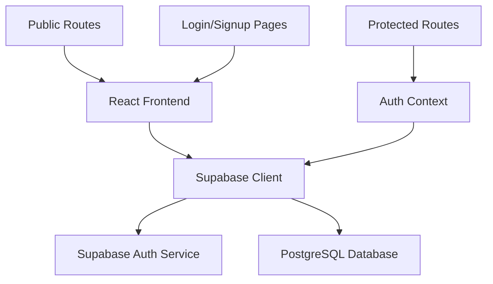
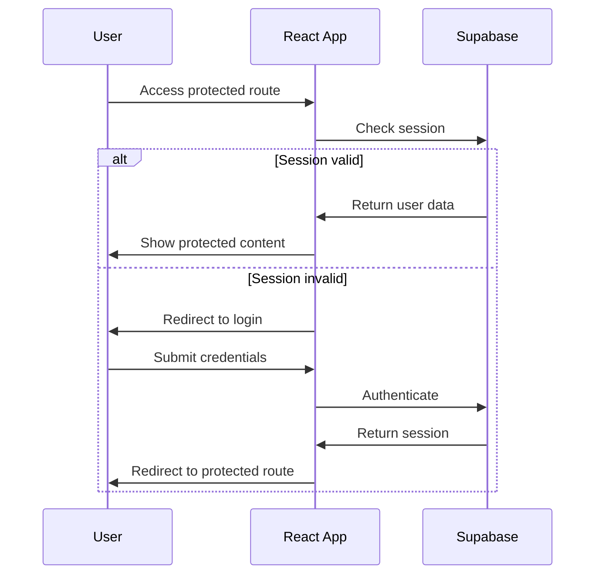

# User Authentication System Design

## Overview

The user authentication system will be built using Supabase as the backend-as-a-service provider, integrated with a React frontend using TypeScript. The system will provide secure user registration, login, session management, and route protection capabilities while following the established project architecture patterns.

## Architecture

### High-Level Architecture



### Authentication Flow



## Components and Interfaces

### Core Components

#### 1. Authentication Context (`src/contexts/auth-context.js`)
- **Purpose**: Global state management for authentication
- **Responsibilities**:
  - Maintain current user state
  - Provide authentication methods (login, signup, logout)
  - Handle session persistence and restoration
  - Manage loading states during auth operations

#### 2. Protected Route Component (`src/components/protected-route.js`)
- **Purpose**: Route-level authentication guard
- **Responsibilities**:
  - Check authentication status before rendering protected content
  - Redirect unauthenticated users to login page
  - Handle loading states during authentication checks

#### 3. Login Page (`src/pages/login.js`)
- **Purpose**: User authentication interface
- **Responsibilities**:
  - Render login form with email/password fields
  - Handle form validation and submission
  - Display authentication errors
  - Redirect authenticated users

#### 4. Sign-up Page (`src/pages/sign-up.js`)
- **Purpose**: User registration interface
- **Responsibilities**:
  - Render registration form with email/password fields
  - Handle form validation and submission
  - Display registration errors
  - Redirect after successful registration

#### 5. Profile Page (`src/pages/profile.js`)
- **Purpose**: Protected user profile interface
- **Responsibilities**:
  - Display user information (email)
  - Provide logout functionality
  - Handle profile-related actions

### Supabase Integration

#### 1. Supabase Client Configuration (`src/lib/supabase.js`)
- **Purpose**: Initialize and configure Supabase client
- **Configuration**:
  - Supabase URL and anonymous key from environment variables
  - Authentication settings and persistence options

#### 2. Authentication Methods
- **signUp(email, password)**: Create new user account
- **signIn(email, password)**: Authenticate existing user
- **signOut()**: End user session
- **getSession()**: Retrieve current session
- **onAuthStateChange()**: Listen for authentication state changes

## Data Models

### User Model (Supabase Auth)
```typescript
interface User {
  id: string;
  email: string;
  created_at: string;
  updated_at: string;
  email_confirmed_at?: string;
  last_sign_in_at?: string;
}
```

### Session Model (Supabase Auth)
```typescript
interface Session {
  access_token: string;
  refresh_token: string;
  expires_in: number;
  expires_at: number;
  token_type: string;
  user: User;
}
```

### Authentication Context State
```typescript
interface AuthContextType {
  user: User | null;
  session: Session | null;
  loading: boolean;
  signUp: (email: string, password: string) => Promise<void>;
  signIn: (email: string, password: string) => Promise<void>;
  signOut: () => Promise<void>;
}
```

## Error Handling

### Authentication Errors
- **Invalid credentials**: Display user-friendly message for login failures
- **Email already exists**: Handle duplicate registration attempts
- **Weak password**: Provide password strength requirements
- **Network errors**: Handle connectivity issues gracefully
- **Session expiry**: Automatic logout and redirect to login

### Form Validation
- **Email validation**: Real-time email format checking
- **Password requirements**: Minimum length and complexity rules
- **Required fields**: Prevent submission with empty fields
- **Loading states**: Disable forms during submission

### Error Display Strategy
- Use consistent error messaging across all forms
- Display errors near relevant form fields
- Provide clear, actionable error messages
- Handle both client-side and server-side validation

## Testing Strategy

### Unit Tests
- **Authentication Context**: Test state management and auth methods
- **Form Components**: Test validation logic and user interactions
- **Protected Route**: Test authentication checks and redirects
- **Supabase Integration**: Mock Supabase client for isolated testing

### Integration Tests
- **Authentication Flow**: End-to-end login/logout scenarios
- **Route Protection**: Test access control for protected routes
- **Session Persistence**: Test session restoration on app reload
- **Error Scenarios**: Test error handling and user feedback

### Test Tools and Approach
- **Jest**: Unit testing framework
- **React Testing Library**: Component testing utilities
- **MSW (Mock Service Worker)**: API mocking for integration tests
- **Test-driven development**: Write tests before implementation

## Security Considerations

### Password Security
- Leverage Supabase's built-in password hashing and validation
- Implement client-side password strength indicators
- Enforce minimum password requirements

### Session Management
- Use Supabase's secure session handling with JWT tokens
- Implement automatic token refresh
- Clear sensitive data on logout

### Route Protection
- Server-side session validation through Supabase
- Client-side route guards for immediate feedback
- Graceful handling of expired sessions

### Environment Security
- Store Supabase credentials in environment variables
- Use Supabase's Row Level Security (RLS) for data protection
- Implement proper CORS configuration

## Implementation Phases

### Phase 1: Foundation
- Set up Supabase client configuration
- Create authentication context with basic state management
- Implement core authentication methods

### Phase 2: User Interface
- Build login and sign-up forms with validation
- Create protected route component
- Implement basic profile page

### Phase 3: Integration
- Connect forms to authentication context
- Implement route protection throughout the application
- Add comprehensive error handling

### Phase 4: Enhancement
- Add loading states and user feedback
- Implement session persistence
- Add comprehensive testing coverage