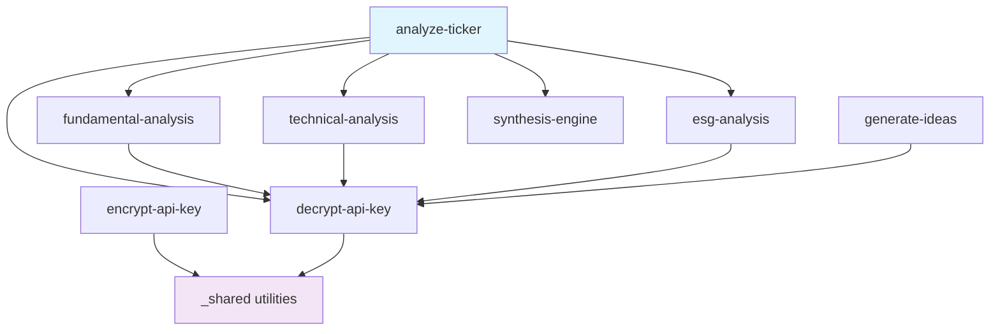

# Signal-360 Edge Functions Deployment Guide

## Overview

This guide provides comprehensive instructions for deploying the Signal-360 Edge Functions to Supabase. The deployment system supports multiple environments, automated testing, and configuration management.

## Architecture

### Edge Functions Structure

```
supabase/functions/
├── analyze-ticker/          # Main orchestrator function
├── fundamental-analysis/    # Financial fundamentals analysis
├── technical-analysis/      # Technical analysis and indicators
├── esg-analysis/           # ESG (Environmental, Social, Governance) analysis
├── synthesis-engine/       # Analysis synthesis and scoring
├── generate-ideas/         # Investment/trading idea generation
├── encrypt-api-key/        # API key encryption service
├── decrypt-api-key/        # API key decryption service
├── _shared/                # Shared utilities and libraries
├── deploy.config.json      # Deployment configuration
└── .env.example           # Environment variables template
```

### Function Dependencies



## Prerequisites

### Required Tools

1. **Supabase CLI**
   ```bash
   npm install -g supabase
   ```

2. **Deno Runtime** (for local testing)
   ```bash
   # macOS
   brew install deno
   
   # Linux/WSL
   curl -fsSL https://deno.land/x/install/install.sh | sh
   ```

3. **jq** (for JSON processing)
   ```bash
   # macOS
   brew install jq
   
   # Linux
   apt-get install jq
   ```

### Supabase Setup

1. **Login to Supabase**
   ```bash
   supabase login
   ```

2. **Link to Project**
   ```bash
   supabase link --project-ref your-project-ref
   ```

3. **Verify Connection**
   ```bash
   supabase projects list
   ```

## Environment Configuration

### 1. Environment Variables

Copy the environment template and configure for your environment:

```bash
cp supabase/functions/.env.example supabase/functions/.env.local
```

#### Required Variables

**Supabase Configuration:**
```bash
SUPABASE_URL=https://your-project.supabase.co
SUPABASE_ANON_KEY=your-anon-key
SUPABASE_SERVICE_ROLE_KEY=your-service-role-key
```

**Security Configuration:**
```bash
ENCRYPTION_KEY=your-32-character-encryption-key-here
```

**External APIs:**
```bash
GOOGLE_API_KEY=your-google-api-key
MARKET_DATA_API_KEY=your-market-data-key
ESG_API_KEY=your-esg-api-key
```

### 2. Supabase Secrets

Set secrets in Supabase dashboard or CLI:

```bash
# Set encryption key
supabase secrets set ENCRYPTION_KEY=your-encryption-key

# Set service role key
supabase secrets set SUPABASE_SERVICE_ROLE_KEY=your-service-role-key

# Set external API keys
supabase secrets set GOOGLE_API_KEY=your-google-api-key
```

### 3. Environment-Specific Configuration

The deployment system supports three environments:

#### Development
- **Purpose**: Local development and testing
- **Rate Limiting**: Disabled
- **Logging**: DEBUG level
- **Cache**: Enabled with short TTL
- **External APIs**: Mock data available

#### Staging
- **Purpose**: Pre-production testing
- **Rate Limiting**: Moderate limits
- **Logging**: INFO level
- **Cache**: Enabled with production TTL
- **External APIs**: Real APIs with higher limits

#### Production
- **Purpose**: Live production environment
- **Rate Limiting**: Strict limits
- **Logging**: WARN level
- **Cache**: Optimized for performance
- **External APIs**: Real APIs with production limits

## Deployment Process

### Automated Deployment

Use the deployment script for automated deployment:

```bash
# Deploy to production (default)
./scripts/deploy.sh

# Deploy to staging
./scripts/deploy.sh --environment staging

# Dry run to see what would be deployed
./scripts/deploy.sh --dry-run --verbose

# Force deployment (skip validation)
./scripts/deploy.sh --force
```

### Manual Deployment

For manual deployment or troubleshooting:

```bash
# Navigate to functions directory
cd supabase/functions

# Deploy individual function
supabase functions deploy analyze-ticker

# Deploy all functions
supabase functions deploy

# Deploy with specific project
supabase functions deploy --project-ref your-project-ref
```

### Deployment Verification

After deployment, verify functions are working:

```bash
# Test main analysis function
curl -X POST \
  https://your-project.supabase.co/functions/v1/analyze-ticker \
  -H "Authorization: Bearer your-jwt-token" \
  -H "Content-Type: application/json" \
  -d '{"ticker_symbol": "AAPL", "analysis_context": "investment"}'

# Test idea generation
curl -X POST \
  https://your-project.supabase.co/functions/v1/generate-ideas \
  -H "Authorization: Bearer your-jwt-token" \
  -H "Content-Type: application/json" \
  -d '{"context": "investment_idea"}'
```

## Configuration Management

### Deployment Configuration (`deploy.config.json`)

The deployment configuration file defines:

- **Function Settings**: Timeout, memory, dependencies
- **Environment Configuration**: URLs, logging, rate limits
- **Security Settings**: CORS, encryption, rate limiting
- **Monitoring Configuration**: Metrics, alerts, thresholds

#### Function Configuration Example

```json
{
  "analyze-ticker": {
    "description": "Main orchestrator for comprehensive financial analysis",
    "timeout": 120,
    "memory": 512,
    "environment": "production",
    "dependencies": [
      "fundamental-analysis",
      "technical-analysis", 
      "esg-analysis",
      "synthesis-engine",
      "decrypt-api-key"
    ],
    "secrets": [
      "SUPABASE_SERVICE_ROLE_KEY",
      "ENCRYPTION_KEY"
    ]
  }
}
```

### Environment-Specific Settings

Each environment has specific configuration:

```json
{
  "production": {
    "supabase_url": "https://prod-project.supabase.co",
    "log_level": "WARN",
    "cache_enabled": true,
    "rate_limiting": {
      "enabled": true,
      "requests_per_minute": 100
    },
    "external_apis": {
      "timeout": 20000,
      "retry_attempts": 3
    }
  }
}
```

## Monitoring and Observability

### Function Monitoring

Each function includes built-in monitoring:

- **Request Metrics**: Count, duration, success rate
- **Error Tracking**: Error rates, types, patterns
- **Performance Metrics**: Response times, cache hit rates
- **Resource Usage**: Memory, CPU, connection pool usage

### Logging Configuration

Structured logging with different levels:

```typescript
// Production logging (WARN level)
logger.warn('High error rate detected', { 
  errorRate: 0.15, 
  threshold: 0.1 
});

// Development logging (DEBUG level)
logger.debug('Cache hit', { 
  key: 'analysis:AAPL:investment',
  hitRate: 0.85 
});
```

### Alerting Thresholds

Configure alerts in `deploy.config.json`:

```json
{
  "monitoring": {
    "alerts": {
      "error_rate_threshold": 0.05,
      "response_time_threshold": 10000,
      "memory_usage_threshold": 0.8
    }
  }
}
```

## Security Considerations

### API Key Management

1. **Encryption**: All API keys encrypted with AES-256
2. **Storage**: Encrypted keys stored in Supabase database
3. **Access**: Keys decrypted only in memory, never logged
4. **Rotation**: Regular key rotation (90 days default)

### Network Security

1. **CORS**: Configured for specific origins
2. **Rate Limiting**: Per-user and per-IP limits
3. **Input Validation**: All inputs validated and sanitized
4. **Security Headers**: OWASP-compliant headers

### Function Security

1. **Authentication**: JWT token validation required
2. **Authorization**: User-specific data access
3. **Secrets Management**: Environment variables and Supabase secrets
4. **Audit Logging**: All security events logged

## Troubleshooting

### Common Deployment Issues

#### 1. Authentication Errors
```bash
Error: Not logged in to Supabase
```
**Solution**: Run `supabase login` and authenticate

#### 2. Project Reference Issues
```bash
Error: Project not found
```
**Solution**: Verify project reference with `supabase projects list`

#### 3. Environment Variable Issues
```bash
Error: Missing required environment variables
```
**Solution**: Check `.env.local` file and Supabase secrets

#### 4. Function Timeout Issues
```bash
Error: Function deployment timeout
```
**Solution**: Increase timeout in `deploy.config.json` or check function size

### Debugging Deployment

#### Enable Verbose Logging
```bash
./scripts/deploy.sh --verbose
```

#### Check Function Logs
```bash
supabase functions logs analyze-ticker
```

#### Test Individual Functions
```bash
# Test locally
supabase functions serve

# Test deployed function
curl -X OPTIONS https://your-project.supabase.co/functions/v1/analyze-ticker
```

### Performance Issues

#### Slow Deployments
- Check function bundle size
- Optimize dependencies
- Use deployment script with parallel deployment

#### Function Cold Starts
- Implement cache warming
- Optimize initialization code
- Use connection pooling

#### Memory Issues
- Reduce cache sizes
- Optimize data structures
- Monitor memory usage

## Rollback Procedures

### Automatic Rollback

The deployment script supports rollback on failure:

```bash
# Deploy with automatic rollback on failure
./scripts/deploy.sh --rollback-on-failure
```

### Manual Rollback

To manually rollback to previous version:

```bash
# List function versions
supabase functions list --project-ref your-project-ref

# Rollback specific function
supabase functions deploy analyze-ticker --version previous

# Rollback all functions
./scripts/rollback.sh --version previous
```

## CI/CD Integration

### GitHub Actions

Create `.github/workflows/deploy.yml`:

```yaml
name: Deploy Edge Functions

on:
  push:
    branches: [main]
  pull_request:
    branches: [main]

jobs:
  test:
    runs-on: ubuntu-latest
    steps:
      - uses: actions/checkout@v3
      - uses: denoland/setup-deno@v1
      - name: Run Tests
        run: |
          cd supabase/functions
          deno test --allow-env --allow-net _shared/*test.ts

  deploy:
    needs: test
    runs-on: ubuntu-latest
    if: github.ref == 'refs/heads/main'
    steps:
      - uses: actions/checkout@v3
      - uses: supabase/setup-cli@v1
      - name: Deploy Functions
        env:
          SUPABASE_ACCESS_TOKEN: ${{ secrets.SUPABASE_ACCESS_TOKEN }}
        run: |
          ./scripts/deploy.sh --environment production
```

### Environment Promotion

Promote deployments through environments:

```bash
# Deploy to development
./scripts/deploy.sh --environment development

# Test and promote to staging
./scripts/deploy.sh --environment staging

# Final promotion to production
./scripts/deploy.sh --environment production
```

## Performance Optimization

### Pre-Deployment Optimization

1. **Bundle Analysis**: Check function bundle sizes
2. **Dependency Optimization**: Remove unused dependencies
3. **Code Splitting**: Optimize shared utilities
4. **Cache Warming**: Pre-populate caches after deployment

### Post-Deployment Monitoring

1. **Response Times**: Monitor function execution times
2. **Error Rates**: Track error patterns and frequencies
3. **Resource Usage**: Monitor memory and CPU usage
4. **Cache Performance**: Track cache hit rates and efficiency

## Maintenance

### Regular Maintenance Tasks

1. **Log Rotation**: Clean up old logs (weekly)
2. **Cache Cleanup**: Clear stale cache entries (daily)
3. **Metrics Review**: Analyze performance metrics (weekly)
4. **Security Updates**: Update dependencies (monthly)

### Health Checks

Automated health checks run every 5 minutes:

```bash
# Manual health check
curl https://your-project.supabase.co/functions/v1/health

# Check specific function
curl -X OPTIONS https://your-project.supabase.co/functions/v1/analyze-ticker
```

### Backup and Recovery

1. **Function Code**: Version controlled in Git
2. **Configuration**: Backed up in deployment config
3. **Secrets**: Managed through Supabase dashboard
4. **Database**: Automatic Supabase backups

## Best Practices

### Deployment Best Practices

1. **Test First**: Always run tests before production deployment
2. **Gradual Rollout**: Deploy to development → staging → production
3. **Monitor Closely**: Watch metrics during and after deployment
4. **Have Rollback Plan**: Be prepared to rollback if issues arise
5. **Document Changes**: Keep deployment logs and change records

### Configuration Management

1. **Environment Separation**: Keep environments isolated
2. **Secret Management**: Use Supabase secrets for sensitive data
3. **Version Control**: Track all configuration changes
4. **Validation**: Validate configuration before deployment

### Security Best Practices

1. **Least Privilege**: Functions have minimal required permissions
2. **Secret Rotation**: Regular rotation of API keys and secrets
3. **Access Logging**: Log all access and security events
4. **Network Security**: Proper CORS and security headers

## API Documentation

### Function Endpoints

| Function | Endpoint | Method | Description |
|----------|----------|--------|-------------|
| analyze-ticker | `/functions/v1/analyze-ticker` | POST | Complete financial analysis |
| generate-ideas | `/functions/v1/generate-ideas` | POST | Investment/trading ideas |
| encrypt-api-key | `/functions/v1/encrypt-api-key` | POST | Encrypt user API keys |
| decrypt-api-key | `/functions/v1/decrypt-api-key` | POST | Decrypt user API keys |

### Request/Response Examples

#### Analyze Ticker
```bash
# Request
curl -X POST \
  https://your-project.supabase.co/functions/v1/analyze-ticker \
  -H "Authorization: Bearer your-jwt-token" \
  -H "Content-Type: application/json" \
  -d '{
    "ticker_symbol": "AAPL",
    "analysis_context": "investment"
  }'

# Response
{
  "success": true,
  "data": {
    "analysis_id": 123,
    "ticker_symbol": "AAPL",
    "synthesis_score": 76,
    "convergence_factors": [...],
    "divergence_factors": [...],
    "full_report": {...}
  },
  "request_id": "req_1234567890_abc123",
  "timestamp": "2024-01-15T10:30:00.000Z"
}
```

#### Generate Ideas
```bash
# Request
curl -X POST \
  https://your-project.supabase.co/functions/v1/generate-ideas \
  -H "Authorization: Bearer your-jwt-token" \
  -H "Content-Type: application/json" \
  -d '{
    "context": "investment_idea"
  }'

# Response
{
  "success": true,
  "data": {
    "ticker_symbol": "MSFT",
    "company_name": "Microsoft Corporation",
    "justification": "Strong fundamentals and growth potential...",
    "confidence": 0.85
  },
  "request_id": "req_1234567890_def456",
  "timestamp": "2024-01-15T10:31:00.000Z"
}
```

## Operational Runbook

### Daily Operations

1. **Monitor Dashboards**: Check function metrics and alerts
2. **Review Logs**: Look for errors or unusual patterns
3. **Check Performance**: Verify response times and cache hit rates
4. **Validate Security**: Review authentication and rate limiting logs

### Weekly Operations

1. **Performance Review**: Analyze weekly performance trends
2. **Error Analysis**: Review error patterns and root causes
3. **Capacity Planning**: Check resource usage and scaling needs
4. **Security Review**: Audit access logs and security events

### Monthly Operations

1. **Dependency Updates**: Update libraries and dependencies
2. **Security Patches**: Apply security updates
3. **Performance Optimization**: Optimize based on usage patterns
4. **Backup Verification**: Verify backup and recovery procedures

### Incident Response

#### High Error Rate
1. Check external API status
2. Review recent deployments
3. Check rate limiting configuration
4. Consider temporary rate limit increases

#### Slow Response Times
1. Check cache hit rates
2. Monitor external API response times
3. Review database query performance
4. Check memory and CPU usage

#### Authentication Issues
1. Verify JWT token configuration
2. Check Supabase auth service status
3. Review user authentication logs
4. Validate API key encryption/decryption

### Emergency Procedures

#### Complete Service Outage
1. Check Supabase platform status
2. Verify DNS and network connectivity
3. Review recent configuration changes
4. Implement emergency rollback if needed

#### Security Incident
1. Immediately rotate affected API keys
2. Review access logs for suspicious activity
3. Temporarily increase rate limiting
4. Notify security team and stakeholders

## Support and Troubleshooting

### Getting Help

1. **Documentation**: Check function-specific README files
2. **Logs**: Review function logs in Supabase dashboard
3. **Metrics**: Check performance metrics and alerts
4. **Community**: Supabase community forums and Discord

### Common Issues and Solutions

| Issue | Symptoms | Solution |
|-------|----------|----------|
| Function timeout | 504 errors, slow responses | Increase timeout, optimize code |
| Memory errors | 500 errors, crashes | Reduce memory usage, optimize caches |
| Rate limiting | 429 errors | Adjust rate limits, implement backoff |
| Authentication | 401 errors | Check JWT tokens, verify auth config |
| External API | 502/503 errors | Check API status, implement circuit breakers |

### Performance Tuning

1. **Cache Optimization**: Adjust TTL values based on usage patterns
2. **Connection Pooling**: Tune pool sizes for optimal performance
3. **Request Batching**: Optimize batch sizes and timeouts
4. **Memory Management**: Adjust cache sizes and eviction policies

The deployment system provides a robust, scalable foundation for the Signal-360 Edge Functions with comprehensive monitoring, security, and operational capabilities.