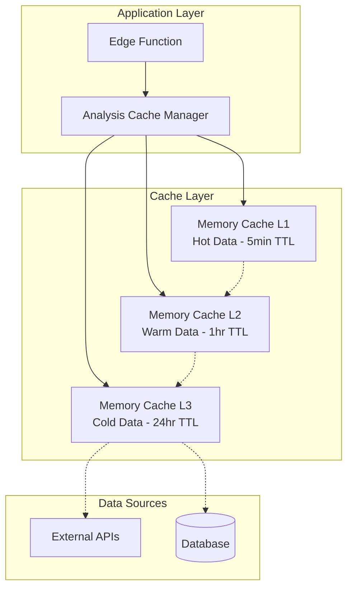

# Performance Optimization and Caching Guide

## Overview

The Signal-360 Edge Functions implement a comprehensive performance optimization and caching system designed to minimize response times, reduce external API calls, and optimize resource usage. The system provides multi-level caching, connection pooling, request batching, and intelligent resource management.

## Architecture

### Multi-Level Caching Strategy



### Performance Optimization Components

1. **Memory Cache**: In-memory caching with LRU eviction and TTL expiration
2. **Connection Pooling**: HTTP connection reuse for external API calls
3. **Request Batching**: Batch multiple requests to reduce API calls
4. **Resource Management**: Memory and CPU usage monitoring and optimization
5. **Lazy Loading**: On-demand resource loading to reduce startup time
6. **Compression**: Data compression for large payloads (when enabled)

## Caching System

### Cache Types and TTL Configuration

| Data Type | Cache Duration | Justification |
|-----------|----------------|---------------|
| **Price Data** | 1 minute | High volatility, frequent updates |
| **Market Data** | 5 minutes | Moderate volatility, regular updates |
| **Technical Indicators (1D)** | 5 minutes | Intraday changes, frequent recalculation |
| **Technical Indicators (1W)** | 30 minutes | Weekly patterns, less frequent updates |
| **Technical Indicators (1M+)** | 1 hour | Long-term patterns, stable data |
| **Fundamental Data** | 1 hour | Quarterly updates, relatively stable |
| **ESG Data** | 24 hours | Annual/semi-annual updates, very stable |
| **Analysis Results** | 15 minutes | Synthesis results, moderate volatility |
| **User API Keys** | 1 hour | Security vs performance balance |
| **Ideas/Suggestions** | 30 minutes | Market-dependent, moderate updates |

### Cache Key Strategy

```typescript
// Analysis results
CacheKeyGenerators.analysis('AAPL', 'investment') 
// → 'analysis:AAPL:investment'

// Market data with timeframe
CacheKeyGenerators.marketData('MSFT', 'price', '1D')
// → 'market:MSFT:price:1D'

// Technical indicators
CacheKeyGenerators.technical('GOOGL', 'sma', '1W')
// → 'technical:GOOGL:sma:1W'
```

### Memory Management

- **Maximum Cache Size**: 1,000 entries per cache type
- **Memory Limit**: 50MB per cache instance
- **Eviction Strategy**: LRU (Least Recently Used) + size-based
- **Cleanup Interval**: 60 seconds for expired entries

## Implementation Guide

### Basic Caching Usage

```typescript
import { MemoryCache, CacheKeyGenerators, CacheTTL } from '../_shared/index.ts';

// Create cache instance
const cache = new MemoryCache({
  maxSize: 1000,
  defaultTtl: CacheTTL.MARKET_DATA,
  maxMemoryMB: 50
});

// Cache data
const key = CacheKeyGenerators.marketData('AAPL', 'price');
cache.set(key, { price: 150.25, volume: 1000000 });

// Retrieve data
const cachedData = cache.get(key);
if (cachedData) {
  return cachedData; // Cache hit
} else {
  // Cache miss - fetch from source
  const freshData = await fetchFromAPI();
  cache.set(key, freshData);
  return freshData;
}
```

### Analysis-Specific Caching

```typescript
import { AnalysisCacheManager, CachedAnalysisService } from '../_shared/index.ts';

// Initialize cache manager
const cacheManager = new AnalysisCacheManager({
  enableMarketDataCache: true,
  enableFundamentalsCache: true,
  maxCacheSize: 1000
});

// Use cached analysis service
const service = new CachedAnalysisService(cacheManager);

// Cached fundamental analysis
const fundamentals = await service.getFundamentalAnalysis('AAPL', async () => {
  return await fetchFundamentalsFromAPI('AAPL');
});
```

### Performance Optimization Decorator

```typescript
import { optimized } from '../_shared/index.ts';

class AnalysisService {
  @optimized({
    cache: true,
    cacheTTL: CacheTTL.FUNDAMENTALS,
    timeout: 30000
  })
  async getFundamentalAnalysis(ticker: string) {
    // This method will be automatically cached and have timeout protection
    return await this.fetchFundamentals(ticker);
  }
}
```

### Connection Pooling

```typescript
import { HTTPConnectionPool } from '../_shared/index.ts';

const connectionPool = new HTTPConnectionPool({
  maxConnections: 10,
  minConnections: 2,
  acquireTimeout: 5000,
  idleTimeout: 30000
});

// Use pooled connection
const connection = await connectionPool.getConnection('api.example.com');
try {
  // Make API call using connection
  const result = await makeAPICall(connection);
  return result;
} finally {
  connectionPool.releaseConnection('api.example.com', connection);
}
```

### Request Batching

```typescript
import { RequestBatcher } from '../_shared/index.ts';

// Create batcher for similar requests
const batcher = new RequestBatcher(
  async (tickers: string[]) => {
    // Batch API call for multiple tickers
    return await fetchMultipleQuotes(tickers);
  },
  (ticker: string) => 'quotes', // Batch key
  { batchSize: 10, batchTimeout: 100 }
);

// Individual requests will be automatically batched
const appleQuote = await batcher.batch('AAPL');
const microsoftQuote = await batcher.batch('MSFT');
```

## Cache Strategies by Function

### 1. Analyze-Ticker Function

**Caching Strategy:**
- Cache complete analysis results for 15 minutes
- Cache individual module results with appropriate TTLs
- Invalidate cache when market conditions change significantly

```typescript
// Cache synthesis results
const synthesisKey = CacheKeyGenerators.analysis(ticker, context, timeframe);
const cachedSynthesis = cache.get(synthesisKey);

if (cachedSynthesis) {
  return cachedSynthesis; // Return cached result
}

// Execute analysis and cache result
const synthesisResult = await executeAnalysis(ticker, context, timeframe);
cache.set(synthesisKey, synthesisResult, CacheTTL.ANALYSIS_RESULTS);
```

### 2. Fundamental Analysis Function

**Caching Strategy:**
- Cache fundamental data for 1 hour (quarterly updates)
- Cache financial ratios and metrics separately
- Use ticker-based cache keys

```typescript
const fundamentalsKey = CacheKeyGenerators.fundamentals(ticker);
const cached = await service.getFundamentalAnalysis(ticker, async () => {
  return await fetchFundamentalsFromAPI(ticker);
});
```

### 3. Technical Analysis Function

**Caching Strategy:**
- Variable TTL based on timeframe (1D: 5min, 1W: 30min, 1M+: 1hr)
- Cache indicators separately for flexibility
- Invalidate on significant price movements

```typescript
const technicalKey = CacheKeyGenerators.technical(ticker, indicator, timeframe);
const ttl = getTechnicalTTL(timeframe);
cache.set(technicalKey, technicalData, ttl);
```

### 4. ESG Analysis Function

**Caching Strategy:**
- Long TTL (24 hours) due to infrequent updates
- Cache complete ESG profiles
- Manual invalidation for ESG events

```typescript
const esgKey = CacheKeyGenerators.esg(ticker);
cache.set(esgKey, esgData, CacheTTL.ESG_DATA);
```

### 5. Generate Ideas Function

**Caching Strategy:**
- Cache ideas for 30 minutes
- Context-specific caching (investment vs trading)
- Invalidate during market volatility

```typescript
const ideasKey = CacheKeyGenerators.ideas(context, timeframe);
const cachedIdeas = await service.getIdeas(context, timeframe, async () => {
  return await generateIdeasFromMarketData(context, timeframe);
});
```

## Performance Monitoring

### Metrics Collection

```typescript
import { PerformanceMetrics } from '../_shared/index.ts';

// Record operation performance
const startTime = performance.now();
const result = await performOperation();
const duration = performance.now() - startTime;

PerformanceMetrics.record('operation-name', duration);

// Get performance statistics
const metrics = PerformanceMetrics.getMetrics('operation-name');
console.log(`Average time: ${metrics.avgTime}ms`);
```

### Cache Performance Monitoring

```typescript
// Get cache statistics
const cacheStats = cache.getStats();
console.log(`Hit rate: ${cacheStats.hitRate}`);
console.log(`Memory usage: ${cacheStats.memoryUsageMB}MB`);

// Get detailed metrics
const metrics = cache.getMetrics();
console.log(`Hits: ${metrics.hits}, Misses: ${metrics.misses}`);
console.log(`Evictions: ${metrics.evictions}`);
```

### Resource Monitoring

```typescript
import { ResourceManager } from '../_shared/index.ts';

const resourceManager = ResourceManager.getInstance();

// Check resource availability
const resources = resourceManager.checkResources();
if (!resources.overall) {
  // Optimize resources or reject request
  resourceManager.optimizeResources();
}

// Get current usage
const usage = resourceManager.getResourceUsage();
console.log(`Memory: ${usage.memoryMB}MB, CPU: ${usage.cpuPercent}%`);
```

## Cache Invalidation Strategies

### Time-Based Invalidation

Automatic expiration based on TTL values:

```typescript
// Set with custom TTL
cache.set(key, data, 5 * 60 * 1000); // 5 minutes

// Use predefined TTL
cache.set(key, data, CacheTTL.MARKET_DATA);
```

### Event-Based Invalidation

Manual invalidation based on events:

```typescript
// Invalidate specific ticker data
cacheManager.invalidateTicker('AAPL');

// Invalidate all market data
marketDataCache.clear();

// Invalidate by pattern
const keysToInvalidate = cache.keys().filter(key => 
  key.startsWith('market:AAPL:')
);
keysToInvalidate.forEach(key => cache.delete(key));
```

### Conditional Invalidation

Smart invalidation based on conditions:

```typescript
// Invalidate if data is stale
const cached = cache.get(key);
if (cached && isDataStale(cached)) {
  cache.delete(key);
}

// Invalidate during high volatility
if (marketVolatility > threshold) {
  technicalCache.clear();
}
```

## Best Practices

### 1. Cache Key Design

- Use hierarchical keys: `type:identifier:context`
- Include version information when needed
- Keep keys short but descriptive
- Use consistent naming conventions

### 2. TTL Selection

- **Hot Data** (frequent updates): 1-5 minutes
- **Warm Data** (regular updates): 15-60 minutes  
- **Cold Data** (infrequent updates): 1-24 hours
- **Static Data** (rare updates): 24+ hours

### 3. Memory Management

- Monitor cache hit rates (target: >70%)
- Set appropriate memory limits
- Use LRU eviction for optimal performance
- Regular cleanup of expired entries

### 4. Error Handling

```typescript
try {
  const cached = cache.get(key);
  if (cached) return cached;
  
  const fresh = await fetchData();
  cache.set(key, fresh);
  return fresh;
} catch (error) {
  // Fallback to cached data even if expired
  const stale = cache.get(key, { allowStale: true });
  if (stale) return stale;
  
  throw error;
}
```

### 5. Cache Warming

```typescript
// Warm up cache with common data
async function warmUpCache() {
  const commonTickers = ['AAPL', 'MSFT', 'GOOGL', 'AMZN', 'TSLA'];
  
  for (const ticker of commonTickers) {
    // Pre-load fundamental data
    await service.getFundamentalAnalysis(ticker, () => 
      fetchFundamentalsFromAPI(ticker)
    );
  }
}
```

## Performance Benchmarks

### Target Performance Metrics

| Operation | Target Time | Acceptable Time | Critical Time |
|-----------|-------------|-----------------|---------------|
| Cache Hit | < 1ms | < 5ms | > 10ms |
| Cache Miss + Fetch | < 500ms | < 2s | > 5s |
| Analysis (Cached) | < 100ms | < 500ms | > 1s |
| Analysis (Fresh) | < 3s | < 10s | > 30s |

### Memory Usage Targets

| Cache Type | Target Size | Max Size | Memory Limit |
|------------|-------------|----------|--------------|
| Market Data | 500 entries | 1000 entries | 25MB |
| Fundamentals | 200 entries | 500 entries | 15MB |
| Technical | 1000 entries | 2000 entries | 30MB |
| ESG | 100 entries | 300 entries | 10MB |
| Synthesis | 300 entries | 600 entries | 20MB |

### Cache Hit Rate Targets

- **Overall Hit Rate**: >70%
- **Market Data**: >80% (frequent access)
- **Fundamentals**: >60% (moderate reuse)
- **Technical**: >75% (timeframe dependent)
- **ESG**: >50% (long TTL, less frequent access)

## Troubleshooting

### Common Performance Issues

1. **Low Cache Hit Rate**
   - Check TTL values (too short?)
   - Verify cache key consistency
   - Monitor cache eviction patterns

2. **High Memory Usage**
   - Reduce cache sizes
   - Implement more aggressive eviction
   - Check for memory leaks

3. **Slow Response Times**
   - Enable connection pooling
   - Implement request batching
   - Optimize cache lookup patterns

4. **Cache Thrashing**
   - Increase cache size
   - Adjust eviction strategy
   - Review access patterns

### Debugging Tools

```typescript
// Enable debug logging
const cache = new MemoryCache({
  enableMetrics: true,
  debugMode: true
});

// Monitor cache performance
setInterval(() => {
  const stats = cache.getStats();
  console.log('Cache Stats:', stats);
}, 30000);

// Track slow operations
PerformanceMetrics.record('slow-operation', duration);
if (duration > 1000) {
  console.warn(`Slow operation detected: ${duration}ms`);
}
```

## Future Enhancements

### Planned Improvements

1. **Distributed Caching**: Redis integration for multi-instance caching
2. **Smart Prefetching**: Predictive cache loading based on usage patterns
3. **Adaptive TTL**: Dynamic TTL adjustment based on data volatility
4. **Cache Compression**: Automatic compression for large cache entries
5. **Cache Analytics**: Advanced analytics and optimization recommendations

### Performance Optimization Roadmap

- **Phase 1**: Basic in-memory caching (✅ Complete)
- **Phase 2**: Advanced eviction strategies and monitoring (✅ Complete)
- **Phase 3**: Distributed caching and persistence (Planned)
- **Phase 4**: Machine learning-based optimization (Future)

The performance optimization and caching system provides a solid foundation for high-performance financial analysis while maintaining data freshness and system reliability.